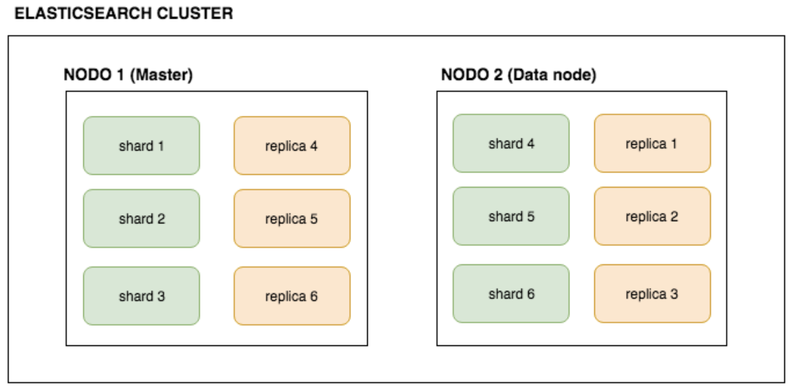
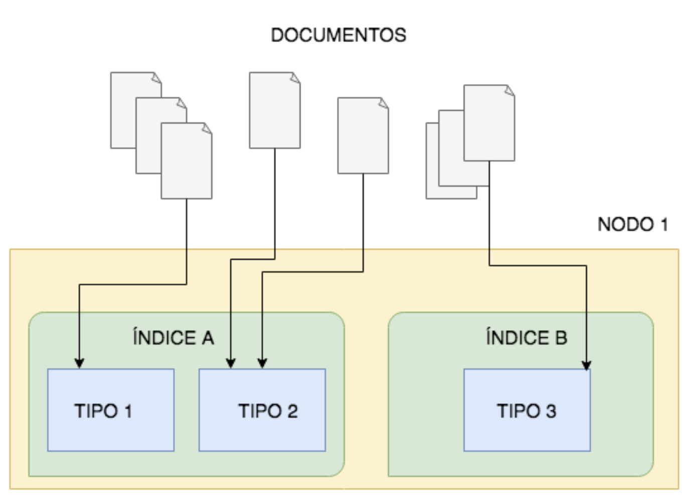
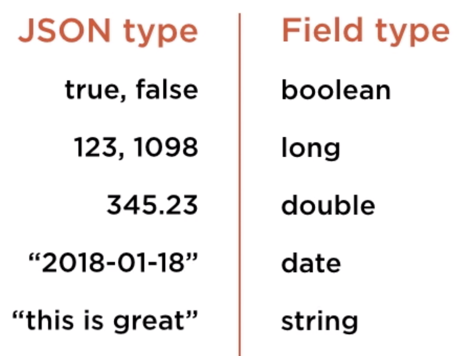
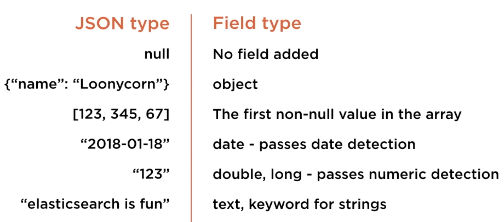

# Elastic Search

Elasticsearch es un motor de búsqueda open source altamente escalable. 

A pesar de que empezó como un buscador de texto ha evolucionado como una herramienta de análisis, que soporta no solo búsquedas simples sino también agregación compleja 
de información. Su naturaleza distribuida permite su escalabilidad a medida que la cantidad de información que contiene crece, sin perder rendimiento de forma significativa.

Elasticsearch está basado en Apache Lucene (al igual que Apache Solr) y está implementado en Java. Lucene provee busqueda e indexación. Elasticsearch extiend Lucene añadiendo una cómoda API REST basada en JSON para facilitar la comunicación 
con Lucene y además provee las características de sistema distribuido que permite escalar la herramienta de forma casi transparente al usuario.

## Cómo funciona una búsqueda

Cualquier aplicación que se precie necesita buscar de alguna forma la información que posee. **Buscar** es encontrar los documentos más relevantes que existan que cumplan con los criterios de búsqueda. Esto parece sencillo pero, en un motor de búsqueda pasan muchas cosas por detrás para llevar a cabo esta tarea aparentemente sencilla.

1.- El motor de búsqueda debe tener conocimiento de la existencia de documentos, encontrarlos e indexarlos.

2.- La indexación de un documento es necesario para que se puedan hacer búsquedas en el futuro.

3.- Por cada palabra de búsqueda que realiza el usuario, tenemos que conocer cómo de relevante es el documento que la contiene. La relevancia es una combinación entre los términos de búsqueda y el documento en sí.

4.- La búsqueda en sí misma.

Estos 4 componentes podrían resumir los componentes necesarios para realizar una búsqueda.

Hay varias tecnologías especializadas en cada uno de estos pasos. Por ejemplo, para el punto 1, un rastreador web rastrea todas las páginas con sus links para tener una visión de todos los documentos que existen. En el punto 2, se indexa cada documento encontrado por el rastreador, es decir, se parsean para que los términos individuales se extraigan y almacenen en una estructura de datos llamada el índice invertido. **El índice invertido es un mapeo de un término al documento donde el término es encontrado**. Es invertido porque va desde el término de búsqueda a la página web del documento. Basado en lo que el usuario buscaba, cada documento tendrá asociado una puntuación llamada puntuación relevante (punto 3). Los documentos tienen que estar puntuados antes que se devuelvan los resultados para que aquellos documentos con las puntuaciones más altas se muestren en los más alto del resultado de la búsqueda. La relevancia es calcula en función del término de búsqueda, así como el documento en sí mismo. Por último (punto 4) el proceso de la búsqueda en sí misma, se buscan los documentos en el índice invertido, encuentra los más relevantes y los devuelve en lo más alto del resultado de búsquedas. Aunque los algoritmos de búsqueda son más complejos que esto, se puede decir que estos 4 pasos son el core de cualquier algoritmo de búsqueda.

### El índice invertido

Antes de avanzar, vamos a intentar entender el índice invertido, la estructura de datos core de cualquier algoritmo de búsqueda. 

El primer paso es conocer la existencia de los documentos para ser indexados y posteriormente buscados. El contenido de los documentos es parseado y dividido en palabras individuales normalizadas en minúsculas, para que todas las palabras puedan compararse en minúsculas, y se elimina cualquier signo de puntuación en las palabras.

Cada palabra tiene asignada una frecuencia. La frecuencia determina el número de veces que aparece la palabra en los documentos que tenemos indexados.

Junto con las palabras y su correspondiente frecuencia, el índice invertido contiene el documento donde aparece cada palabra. Cada palabra que contiene el índice invertido puede aparecer en uno o más documentos. Resumiendo, el índice invertido son todas las diferentes palabras junto con la frecuencia de aparición y los documentos en los que aparece.

A las palabras y su frecuencia correspondiente se le llama **diccionario**. Normalmente, el diccionario está ordenado para que la búsqueda de una determinado palabra sea muy efectiva. Cuando introducimos un término para realizar una búsqueda, éste se busca en el diccionario ordenado y los correspondientes documentos donde ha aparecido (llamados **postings**), que en terminología de índice invertido se llama la **posting list**.

Por ejemplo, dado que tenemos el siguiente ejemplo de índice invertido, si buscamos por el término *winter*, éste lo encontraríamos en el índice invertido, y veríamos que el origen dónde aparece el elemento es *Stark*. Y por lo tanto, el posicionamiento sería (posting list) el documento Stark. Este resultado es el que devolveríamos en la búsqueda. Mientras que, si por ejemplo, buscásemos el término *is*, como éste aparece en dos documentos, el resultado de la búsqueda sería dos regisros, *Stark* y *Baratheon*. 

Podemos hacer búsqueda más complejas combinando términos de búsqueda con AND o OR. O por ejemplo, búsquedas que terminen en **ong**, el índice invertido escanea todas las palabras que contiene y les da la vuelta mapeándola a los mismos documentos origen. Igualmente, para hacer búsquedas de substrings, el índice invertido utiliza otra técnica usando el índice invertido. O para hacer búsquedas geográficas, utiliza otro tipo de técnicas usando el índice invertido.

En definitiva, el índice invertido es el corazón de cualquier motor de búsqueda.

### Lucene: el motor de búsqueda

Apache Lucene es un motor de búsqueda Open Source. Lucene es una librería de indexación y búsqueda de alto rendimiento que ofrece además búsqueda full text. Lucene puede ser utilizado como motor de búsqueda para cualquier plataforma y aplicación. Proporciona capacidades de escrapeo y parseado de documentos. Lucene proporciona también algoritmos de búsqueda muy eficientes escritos originalmente en Java, pero puede ser portado a otros lenguajes.

Lucene es el núcleo de otras tecnologías que están construidas alrededor de Lucene, como por ejemplo Solr que añade indexación distribuída, balanceo de carga, replicación, recuperación automática, etc... Elasticsearch es otro ejemplo de tecnología que por debajo tiene a Lucene como motor de búsqueda permitiendo un motor de búsquedas distribuídas y un motor de análisis de datos.

### Elasticsearch

Elasticsearch es una tecnología Open Source. Es un motor de búsqueda y análisis escrito en Java y que usa Apache Lucene como la librería core para realizar las búsquedas. Es decir, no solo se usa para buscar sobre documentos sino también para analizar y hacer agregaciones complejas sobre los resultados de búsqueda.

Pero, cuales son los puntos fuertes de Elasticsearch?
1.- **Distribución**: permite escalar a miles de nodos en un sólo clúster lo que implica un alto rendimiento en las operaciones de búsqueda.
2.- **Alta disponibilidad**: es tolerante a fallos ya que tiene varias copias de la información en el clúster. Cada índice es replicado.
3.- **API REST**: existe un API REST sencillo para realizar operaciones CRUD sobre índices y documentos.
4.- **DSL potente**: posee un DSL para poder expresar consultas complejas con un lenguaje de dominio sencillo usando JSON.
5.- **Schemaless**: todos los documentos e índices que se almacenan en Elasticsearch no necesitan de un esquema ni tipado de datos.

Elasticsearch está desarrollado por la compañía [Elastic](http://elastic.co), desde el 2015. Elastic tiene además otros productos relacionados con Elasticsearch, como por ejemplo:
 - Kibana: es una herramienta de visualización para navegar por los documentos almacenados en Elasticsearch.
 - Beats: es un agente que envía datos desde otras máquinas para que lleguen a Elasticsearch.
 - Logstash: es un procesador de datos que puede analizar datos que vienen de varios orígenes.
 - X-Pack: es una herramienta de monitorización y reporte.
 - Cloud: que permite tener a Elasticsearch y Kibana en AWS.
 
### Instalación

Para instalar Elasticsearch descargamos del sitio oficial la versión que deseemos descargar. En este caso he bajado la versión 7.6.1.

Una vez descargado, descomprimimos el fichero y desde un nivel superior a la carpeta donde hemos descomprimido el fichero ejecutamos 

```./elasticsearch-7.6.1/bin/elasticsearch```

Con esto arrancamos un nodo de Elasticsearch corriendo en local en un clúster que por defecto se llama **elasticsearch**. Y podemos ver en las trazas que ha creado un nodo con un identificador autogenerado.

```[AFE0811358.home] initialized```

Podemos arrancar otros nodos al mismo clúster con la misma instrucción indicando el nombre del clúster. Por ejemplo

```
./elasticsearch -Epath.data=data2 -Epath.logs=log2
./elasticsearch -Epath.data=data3 -Epath.logs=log3
```

Si queremos dar un nombre específico al clúster y al nodo, podemos hacerlo de la siguiente manera

```./elasticsearch-7.6.1/bin/elasticsearch -Ecluster.name=isma_es -Enode.name=my_first_node```

### Conceptos básicos de Elasticsearch

Elasticsearch permite hacer búsquedas prácticamente en tiempo real, con una latencia de aproximadamente 1 segundo entre el tiempo que un documento es indexado y el tiempo en el que el documento está disponible para ser buscado.

#### Nodos
Elasticsearch es distribuido por naturaleza. Se ejecuta en varias máquinas (físicas o virtuales) dentro un **clúster**. Cada una de esas máquinas dentro del clúster es un **nodo**.

Cada nodo tiene un identificador y nombre únicos. Cada nodo dentro del clúster realiza las operaciones de indexación para poder indexar todos los documentos que se añaden a Elasticsearch. Todos los nodos también participan en las operaciones de búsqueda y análisis. Cualquier búsqueda se ejecutará en varios nodos en paralelo.

Cada nodo dentro del clúster tiene un identificador y nombre único. Estos datos son para referirnos a un nodo en las tareas de administración del clúster.

##### Tipos de nodo

En Elasticsearch hay 4 tipos de nodos:

 - Nodos maestros se encargan de configurar y administrar el clustes de ES, como por ejemplo, para añadir nuevos nodos hay que hacerlo a través de los nodos maestros.
 - Nodos de datos se encargan de almacenar documentos. Este tipo de nodos tiene sentido hacer réplicas.
 - Nodos cliente sirven para comunicarnos con el nodo maestro o para recoger información.
 - Nodos de ingesta se encargan de preprocesar los documentos antes de almacenarlos. Son poco frecuentes. Por ejemplo, si la indexación de documentos es un cuello de botella porque en un corto periodo de tiempo se tienen que indexar miles de documentos, entonces se puede crear un nodo de ingesta para que procese esta información.

#### Clúster

Un **cluster** es una colección de nodos que operan juntos para llevar a cabo un mismo objetivo. Un clúster de Elasticsearch puede escalar a cientos e incluso miles de nodos, o incluso un único nodo en el clúster. Cualquier índice que se cree para que los documentos sean susceptibles de ser buscados se guardan en el clúster. Todo clúster tiene un nombre único, que si no se especifica, por defecto es **elasticsearch**. 

Cada clúster tiene un nombre único y es por este nombre por el que se unen los nodos dentro del clúster.

La forma que tenemos de escalar es añadir nuevos nodos al clúster es especificando el nombre de éste a la hora de levantarlo. Los nodos dentro del clúster se encontrán a sí mismos dentro de Elasticsearch enviándose mensajes. Las máquinas que representan los nodos dentro del clúster deben estar en la misma red.

#### Tipos de documentos (deprecado a partir de la versión 6)

Los **documentos** son la información que vamos a querer almacenar en Elasticsearch. Éstos pueden tener cualquier información dependiendo de nuestro modelo de negocio. Estos documentos los podemos indexar formando una agrupación lógica, por ejemplo, dentro de un mismo índice de productos, podríamos tener documentos de móviles, de portátiles, etc... y estos podríamos indexarlos de forma lógica como distintos tipos de documentos. 

Cada uno de estos tipos de documentos forman parte de un **índice**, que es dónde se va a buscar. Por ejemplo, en un Site de Blogs, los artículos serían un tipo de documento, los comentarios sobre los artículos podrían ser otro tipo de documento. No es condición necesaria para Elasticsearch que un índice esté formado por un único tipo de documento, un índice puede estar formado por documentos de distintos tipos.

#### Índice

El índice en Elasticsearch se refiere a un conjunto de documentos similares. No necesitan ser exactamente del mismo tipo. Por dar una analogía con el mundo de base de datos relaciones, un índice
sería como una base de datos que puede contener distingos tipos de documentos (tablas en el mundo base de datos). Por lo tanto, podríamos tener un índice de catálogo de productos, otro de catálogo de usuarios, etc..., luego, Elasticsearch nos permitirá realizar búsquedas incluso entre varios índices.

Un índice se identifica únicamente en un clúster por su nombre, y se pueden tener cualquier número de índices dentro de un clúster. Lo normal es que los índices estén formados por documentos del mismo tipo porque luego se querrán hacer búsquedas sobre ellos. Los documentos con los mismos campos suelen pertenecer a un tipo. 

Un **tipo de documento** es una colección de documentos con las mismas características dentro de un índice.

#### Documentos

Un **documento** es la unidad de información que necesita ser indexada. Solamente es un contenedor de texto que necesita ser buscado. Los documentos en Elasticsearch son expresados en JSON. Todos los documentos se encuentran en un índice. Un documento es asignado a un tipo y un índice. Con el tipo y el índice logramos identificar un conjunto de documentos. Un índice puede estar compuesto por una gran cantidad de documentos, y puede pasar que almacenar todos estos documentos ocupen una gran cantidad de espacio y no quepan físicamente en un disco de un solo nodo. 

#### Shards o fragmentos

Si el número de documentos a almacenar es muy grande o el tamaño de estos documentos es enorme entonces el índice puede llegar a ser demasiado grande para que quepa en un solo nodo. Esto hará que nuestras búsquedas sean demasiado lentas. Para solucionar este problema se aconseja que el índice se separe entre varias máquinas o nodos en el clúster. Este proceso se llama **fragmentación (sharding)** de datos. Por eso, la solución es separar el índice a través de varios nodos en el clúster, donde cada nodo contenga una fragmentación (shard) del índice, es decir, que cada nodo tendrá sólo un subconjunto de datos del índice. El índice completo será la combinación de poner todos los nodos juntos. Y el concepto de **shards** o fragmentos, es lo que nos permite realizar búsquedas en paralelo en diferentes nodos. Lo que se hace en definitiva es, cuando buscamos un término, buscar de forma paralela en subconjunto de datos que son más pequeños y por tanto más fácil de encontrar lo que buscamos.

#### Réplicas

Para tener alta disponibilidad de la información y tolerantes a fallos necesitamos replicar la información. Esto se hace configurando **réplicas** de nuestro índice. Cada **shard** tendrá una o varias réplicas. Así, si uno de nuestros nodos falla, su información estará replicada en un shard de otro nodo.

Así que, fragmentando nuestro índice y replicando cada shard es como conseguimos que las operaciones de búsqueda sean eficientes y rápidas, y que nuestro clúster sea tolerante a fallos y altamente disponible.

Con los shards conseguimos también escalar en volumen y rendimiento buscando entre todas las réplicas a la vez.

#### Conclusión

Un índice se puede separar en varias máquinas, formando así subconjuntos de índice, y a estos subconjuntos de índice se le llaman **shards**.

Un **shard** puede ser **replicado** cero o más veces. Podemos tener tantas réplicas como pensemos que vayamos a necesitar.

Por defecto, Elasticsearch tiene 5 shards y 1 réplica. Así que, cada shard tiene un backup.

El número de shards debe indicarse a la hora de crear el índice, una vez creado no se puede modificar. Pero, el número de réplicas se puede cambiar de forma dinámica, una vez que el índice haya sido creado e indexado.

Visión general de un clúster de Elasticsearch



Visión general de cómo se gestionan los índices en los nodos



### Monitorizando el clúster

A continuación una serie de endpoints para comprobar el estado general de nuestro Elasticsearch

#### Información genérica

Una vez arrancado el clúster de Elasticsearch, podemos consultar su estado haciendo una petición a 
```http://localhost:9200```

y nos saldrá una información parecida a esta:

```
{
  "name": "my_first_node",
  "cluster_name": "isma_es",
  "cluster_uuid": "5F0T_vqoRvWtyGztDMjtGA",
  "version": {
    "number": "7.6.1",
    "build_flavor": "default",
    "build_type": "tar",
    "build_hash": "aa751e09be0a5072e8570670309b1f12348f023b",
    "build_date": "2020-02-29T00:15:25.529771Z",
    "build_snapshot": false,
    "lucene_version": "8.4.0",
    "minimum_wire_compatibility_version": "6.8.0",
    "minimum_index_compatibility_version": "6.0.0-beta1"
  },
  "tagline": "You Know, for Search"
}
```

Nos presenta información básica como el nombre del nodo (name), el nombre del clúster (cluster_name), el identificador del clúster (cluster_uuid) y la versión de Elasticsearch (version.number).

#### Información del estado del clúster, shards y réplicas

```
http://localhost:9200/_cat/health?v&pretty
```

La respuesta de este endpoint nos da la información del número de nodos disponibles (node.total), el número de nodos de datos (node.data), el estado del clúster (status).

Si el **status** del clúster es **green** indica que todos los shards y réplicas del clúster están disponibles para hacerles peticiones. El clúster es totalmente funcional.

Si el **status** del clúster es **yellow** indica que el clúster sigue siendo capaz de procesar peticiones pero puede que ciertas réplicas no estén disponibles.

Si el **status** del clúster es **red** indica que algunos shards de algunos índices no están disponibles, ni tampoco sus réplicas. El clúster no es totalmente funcional y necesita ser arreglado para evitar que pierda información.

#### Información de nodos

```
http://localhost:9200/_cat/nodes?v&pretty
```

Este endpoint nos indica los nodos que tenemos disponibles dentro del clúster. 

## Usando el API de Elasticsearch

Elasticsearch tiene una potente RESTful API para hacer todo tipo de operaciones sobre Elasticsearch.

### Crear índices

Para crear un índice, por ejemplo *candidates*, para tener un catálogo de los candidatos de nuestros clientes

```
PUT http://localhost:9200/candidates?&pretty
```

El nombre **candidates** será el nombre del índice que queremos crear.

### Listar los índices

Para ver los índices de nuestro Elasticsearch

```
GET http://localhost:9200/_cat/indices?v&pretty
```

Un ejemplo de la respuesta sería

```
health status index      uuid                   pri rep docs.count docs.deleted store.size pri.store.size
yellow open   candidates f2pcFbuuQe-6QFO60RcsSw   1   1          0            0       283b           283b
```

Cuando creamos un índice, Elasticsearch asigna automáticamente un UUID, indicado por el campo **uuid**, al índice. Por defecto, en la versión 7.6.1, cuando se crea un índice se asigna 1 shard, indicado por el campo **pri**, y 1 réplica, indicado por el campo **rep**. En versiones anteriores, por defecto, se asignaba a 5 shards y 1 réplica.

El número de documentos del índice viene indicado por el campo **docs.count**.

El tamaño que ocupa el índice viene indicado por el campo **store.size**.

Cuando se crea el índice, se puede ver que el campo **health** está a **yellow**, esto es porque es un clúster de un solo nodo, y al no haber otro nodo donde hacer la réplica del nodo, el nodo mismo guarda la réplica, pero sería un problema si este nodo lo perdiésemos por algún motivo

### Añadir documentos al índice

Para añadir un documento a un índice hacemos una petición PUT con un request body con el contenido del documento

```
PUT http://localhost:9200/cvs/candidates/c388034b-98e7-4e30-af59-be3c7fde36af?pretty

{
	"name": "Ismael",
	"surname": "Cabañas Garcia"
}
```

La respuesta que recibimos es algo como esto

```
{
  "_index": "cvs",
  "_type": "candidates",
  "_id": "c388034b-98e7-4e30-af59-be3c7fde36af",
  "_version": 1,
  "result": "created",
  "_shards": {
    "total": 2,
    "successful": 1,
    "failed": 0
  },
  "_seq_no": 0,
  "_primary_term": 1
}
```

La respuesta nos indica que se ha creado un documento en el índice **cvs** del tipo **candidates** con el identificador **c388034b-98e7-4e30-af59-be3c7fde36af**. El campo **version** indica el número de veces que el documento se ha actualizado (cuando es creado por primera vez el valor es 1). El campo **result** indica la operación que se ha llevado a cabo, en este caso **created**. 

### Recuperar documentos por id

```
GET http://localhost:9200/cvs/candidates/c388034b-98e7-4e30-af59-be3c7fde36af?pretty
``` 

La respuesta será parecida a esta

```
{
  "_index": "cvs",
  "_type": "candidates",
  "_id": "c388034b-98e7-4e30-af59-be3c7fde36af",
  "_version": 1,
  "_seq_no": 0,
  "_primary_term": 1,
  "found": true,
  "_source": {
    "name": "Ismael",
    "surname": "Cabañas Garcia"
  }
}
```

Lo destacable de esta respuesta es que el contenido del documento se encuentra en el campo **_source**. Si el contenido del documento es muy grande, éste campo será a su vez muy grande y afectará al rendimiento de la respuesta pues es información que se tiene que enviar al cliente.

El campo **found** nos indica si encontró el documento en el índice, en este caso es *true* pero si no lo encontrase devolvería *false* y el campo *_source* no vendría en la respuesta.

Si no estuviésemos interesados en el contenido del documento, podemos añadir el parámetro **_source=false** a la petición.

```
GET http://localhost:9200/cvs/candidates/c388034b-98e7-4e30-af59-be3c7fde36af?pretty&_source=false
``` 

Si sólo nos interesan ciertos campos del contenido, podemos añadir el parámetro **_source=field1, ..., fieldN**

```
GET http://localhost:9200/cvs/candidates/c388034b-98e7-4e30-af59-be3c7fde36af?pretty&_source=name
``` 

### Información del índice

Una vez tenemos documentos en nuestro índice, una información interesante es consultar el endpoint

```
http://localhost:9200/candidates
```

La respuesta nos da mucha meta-información del índice, como por ejemplo los tipos que ha asignado Elasticsearch a cada uno de los campos de los documentos.


### Actualización de documentos

Cuando queremos actualizar el contenido de un documento, éste necesita ser reindexado o actualizado. Se puede actualizar todo el contenido del documento o hacer una actualización parcial. 

El endpoint para realizar una **actualización total** de un documento es similar al endpoint para crear un documento, solo que cambiamos el contenido

```
PUT http://localhost:9200/cvs/candidates/c388034b-98e7-4e30-af59-be3c7fde36af?pretty

{
	"name": "Ismael",
	"surname": "Bernardino Garcia"
}
```

La respuesta también es similar a la respuesta obtenida cuando creabamos un documento

```
{
  "_index": "candidates",
  "_type": "cvs",
  "_id": "f26bea19-120c-4f50-be95-c6e3acd15cb7",
  "_version": 2,
  "result": "updated",
  "_shards": {
    "total": 2,
    "successful": 1,
    "failed": 0
  },
  "_seq_no": 4,
  "_primary_term": 1
}
```

Pero la diferencia viene en los campos **version** y **result**. El campo **version** vemos que aumenta en 1, indicando que hay una nueva versión del documento, el campo **result** indica que es una actualización.

Para realizar una **actualización parcial** de un documento debemos realizar una petición más concreta, debe ser con el método POST, el path **_update** y en el body de la petición un campo **doc**. Veamos un ejemplo en el que queremos añadir un nuevo campo a un documento, la petición para realizar esto sería algo como esto

```
POST http://localhost:9200/candidates/cvs/f26bea19-120c-4f50-be95-c6e3acd15cb7/_update?pretty

{
	"doc": {
		"age": 44 
	}
}
```

Y la respuesta obtenida

```
{
  "_index": "candidates",
  "_type": "cvs",
  "_id": "f26bea19-120c-4f50-be95-c6e3acd15cb7",
  "_version": 3,
  "result": "updated",
  "_shards": {
    "total": 2,
    "successful": 1,
    "failed": 0
  },
  "_seq_no": 5,
  "_primary_term": 1
}
```

Y vemos que se ha incrementado el campo **version** y el campo **result** indica que es una actualización. Y si consultamos el documento, veremos que aparece el nuevo campo **age** en el documento, pero los otros documentos del mismo tipo no tendrán tal campo.

También podemos usar este mismo endpoint para actualizar campos existentes

```
POST http://localhost:9200/candidates/cvs/f26bea19-120c-4f50-be95-c6e3acd15cb7/_update?pretty

{
	"doc": {
		"name": "Ismael"
	}
}
```

Si realizamos una actualización parcial sin se produzca ningún cambio en el documento, la respuesta que recibiremos será parecida a 

```
{
  "_index": "candidates",
  "_type": "cvs",
  "_id": "f26bea19-120c-4f50-be95-c6e3acd15cb7",
  "_version": 4,
  "result": "noop",
  "_shards": {
    "total": 0,
    "successful": 0,
    "failed": 0
  },
  "_seq_no": 6,
  "_primary_term": 1
}
```

El campo **result** indicará el valor **noop**, y el valor del campo **version** no cambiará.

El API Rest de Elasticsearch nos permite hacer actualizaciones parciales en base a un **script**

```
POST http://localhost:9200/candidates/cvs/f26bea19-120c-4f50-be95-c6e3acd15cb7/_update?pretty

{
	"script": "ctx._source.age += 2"
}
```

### Borrado de documentos

#### Borrado de un documento en el índice

Después de haber creado un documento en un índice, si quisiéramos eliminarlo deberíamos hacer una petición DELETE del documento

```
DELETE http://localhost:9200/candidates/cvs/724f918a-b1d3-4e5e-b024-f424a3cbee5d?pretty
```

La respuesta obtenida sería parecida a 

```
{
  "_index": "candidates",
  "_type": "cvs",
  "_id": "724f918a-b1d3-4e5e-b024-f424a3cbee5d",
  "_version": 2,
  "result": "deleted",
  "_shards": {
    "total": 2,
    "successful": 1,
    "failed": 0
  },
  "_seq_no": 9,
  "_primary_term": 1
}
```

Indicando en el campo **result** que la operación realizada fue borrado de un documento.

Si intentamos eliminar un documento que no existe dentro del índice, obtendríamos una respuesta parecida a 

```
{
  "_index": "candidates",
  "_type": "cvs",
  "_id": "724f918a-b1d3-4e5e-b024-f424a3cbee5d",
  "_version": 2,
  "result": "deleted",
  "_shards": {
    "total": 2,
    "successful": 1,
    "failed": 0
  },
  "_seq_no": 9,
  "_primary_term": 1
}
```

Indicando en el campo **result** el valor **not_found**.

#### Existencia de un documento

Una alternativa para comprobar si un documento existe o no dentro de un índice sería realizar una peteción HEAD del documento, por ejemplo

```
HEAD http://localhost:9200/candidates/cvs/724f918a-b1d3-4e5e-b024-f424a3cbee5d?pretty
```

Si el documento no existe el código de estado de la respuesta será un **404**, en cambio, si existe el código de estado de la respuesta será un **200**.

Hay que tener en cuenta que cuando borramos un documento de Elasticsearch éste **no se elimina del índice inmediatamente** sino que se marca como borrado lógico, y más tarde, cuando se producen los procesos de sincronización de Elasticsearch para consolidar espacio en disco, es cuando el borrado tiene lugar. 

#### Borrado de un índice

Podemos borrar todos los documentos de un índice borrando el índice completo.

Si intentamos eliminar un índice que no existe

```
DELETE http://localhost:9200/cvss?pretty
```

Obtendremos una respuesta de error indicando que el índice no se encontró: 

```
{
  "error": {
    "root_cause": [
      {
        "type": "index_not_found_exception",
        "reason": "no such index [cvss]",
        "resource.type": "index_or_alias",
        "resource.id": "cvss",
        "index_uuid": "_na_",
        "index": "cvss"
      }
    ],
    "type": "index_not_found_exception",
    "reason": "no such index [cvss]",
    "resource.type": "index_or_alias",
    "resource.id": "cvss",
    "index_uuid": "_na_",
    "index": "cvss"
  },
  "status": 404
}
```

En cambio, si borramos un índice existente recibiremos una respuesta

```
{
  "acknowledged": true
}
```

Y si listásemos los índices del clúster, veríamos que el eliminado ya no se encontraría entre ellos.

### Operaciones Bulk

Elasticsearch no nos permite hacer operaciónes bulk de edición de documentos, pero sí nos permite obtener documentos y ejecutar varias acciones en una petición.

#### _mget

Podemos obtener varios documentos con el path **_mget**, por ejemplo

```
GET http://localhost:9200/_mget?pretty

{
	"docs": [
		{
			"_index": "candidates",
			"_type": "cvs",
			"_id": "5592c48f-08c4-44eb-aac6-cbbeeedf97d9"
		},
		{
			"_index": "candidates",
			"_type": "cvs",
			"_id": "2ee7b73d-0605-4441-8ece-aae108ee2cc6"
		}
	]
}
```

En el cuerpo de la petición, podemos ver que indicamos el índice, el tipo de documento, y el identifcador del documento que queremos recuperar.

Y la respuesta que obtendríamos sería

```
{
  "docs": [
    {
      "_index": "candidates",
      "_type": "cvs",
      "_id": "5592c48f-08c4-44eb-aac6-cbbeeedf97d9",
      "_version": 2,
      "_seq_no": 3,
      "_primary_term": 1,
      "found": true,
      "_source": {
        "name": "Beatríz",
        "surname": "Bernardino Nuño"
      }
    },
    {
      "_index": "candidates",
      "_type": "cvs",
      "_id": "2ee7b73d-0605-4441-8ece-aae108ee2cc6",
      "_version": 1,
      "_seq_no": 0,
      "_primary_term": 1,
      "found": true,
      "_source": {
        "name": "Saúl",
        "surname": "Cabañas Bernardino"
      }
    }
  ]
}
```

Un campo **docs** con un array de los documentos encontrados.

La misma respuesta obtendríamos si en lugar de especificar el índice en el cuerpo de la petición lo hiciésemos en el path de la petición, por ejemplo

```
GET http://localhost:9200/candidates/_mget?pretty
```

La misma respuesta obtendríamos si en lugar de especificar el tipo de documento en el cuerpo de la petición lo hiciésemos en el path de la petición, por ejemplo

```
GET http://localhost:9200/candidates/cvs/_mget?pretty
```

#### _bulk

Podemos ejecutar varias acciones en un petición con el path **_bulk**. Mejor ver la documentación de Elasticsearch si necesitamos un caso de uso de este estilo. 

Básicamente, podemos hacer operaciones de crear, borrar, o actualizar documentos en una sola petición a Elasticsearch, y el API nos respondería individualmente por cada acción.

### Operaciones bulk sobre el índice

Podemos hacer operaciones bulk sobre un índice, como por ejemplo indexar documentos a partir de un fichero JSON. Éste JSON debe tener un formato específico, un ejemplo sería:

```
{"index": {"_index": "candidates", "_type": "cvs", "_id": "uuid"}}
{"name": "Ismael", "surname": "Cabañas García"}
...
{"index": {"_index": "candidates", "_type": "cvs", "_id": "uuid"}}
{"name": "Ismael", "surname": "Cabañas García"}
```

Mejor ver también la documentación oficial de Elasticsearch si tuviésemos que realizar un caso de uso similar.

## Peticiones de búsqueda utilizando el Elasticsearch Query DSL

Como vimos anteriormente, el objetivo de una búsqueda es encontrar los documentos más relevantes basados en los términos de búsqueda.

DSL es un lenguaje específico del dominio. Query DSL es un lenguaje de búsqueda que nos permite expresar consultas complejas. Se conecta con el motor de búsqueda de Lucene a través de JSON.

Las búsquedas en Elasticsearch operan bajo dos contextos completamente diferentes, que intentan responder a distintos problemas de búsqueda:
 - Cómo de bien se ajusta este documento a esta consulta?
 - Éste documento se ajusta a esta cláusula de consulta?

La primera de ellas no es una respuesta de sí o no, sino que para saber cómo de bien se ajusta un documento a una query, se necesita una puntuación para cada documento. Mientras que la segunda pregunta basta con dar una respuesta de sí o no.

La primera pregunta se ejecuta en el contexto **Query Context**, y la segunda se ejecuta en el contexto de **Filter Context**.

### Query Context

En este contexto, lo primero es saber si el documento se incluye o no en el resultado de la consulta. 

Lo segundo es calcular la relevancia del documento: para cada término de búsqueda se asocia una puntuación con el documento, que es parte del resultado de la búsqueda. 

Por último, cuanto más puntuación tiene un documento más alto será mostrado en el ranking de búsquedas. Cuanto más puntuación, más relevancia tiene el documento. El usuario siempre quiere ver primero los documentos más relevantes. 

### Filter Context

Este contexto opera de forma diferente al Query Context. Lo primero es saber si el documento se incluye o no en el resultado de la consulta. Este paso es exactamente el mismo que para el **Query  Context**. 

Pero, en este contexto, no existe el concepto de puntuación individual de cada documento.

Este contexto se suele usar cuando se quiere filtrar datos desestructurados, coincidencias exactas, rangos de consultas (date greater than ....)

Este tipo de consultas tienen un rendimiento mucho mejor que las consultas realizadas con **Query Contesxt**. El **Filter Context** sólo necesita saber si el documento ha sido o no incluído en el resultado de la búsqueda, no es necesario calcular ninguna puntuación asociada al documento. Por lo tanto, es el método más eficiente.

### Generando un juego de datos

Para probar realizar consultas con Elasticsearch primero vamos a generar un conjunto de datos para incluirlos en Elasticsearch. En (json-generator)[https://www.json-generator.com/] tenemos una utilidad que nos puede generar un juego de datos a partir de una plantilla, como esta:

```
[
  '{{repeat(1000, 1000)}}',
  {
    id: '{{guid()}}',
    name: '{{surname()}}, {{firstName()}}',
    lastPosition: '{{lorem(1, "words")}}',
    birthDate: '{{date(new Date(1970, 0, 1), new Date(2002,0,1), "YYYY-MM-ddThh:mm:ss Z")}}',
    lastUpdated: '{{date(new Date(1970, 0, 1), new Date(), "YYYY-MM-ddThh:mm:ss Z")}}',
    processes: '{{integer(0, 4)}}',
    province: '{{city()}}',
    town: '{{state()}}',
    tags: [
      '{{repeat(0,5)}}',
      {
        id: '{{guid()}}',
        ownerId: '{{integer(1,999}}',
        description: '{{lorem()}}'
      }
    ],
    attachments: [
      '{{repeat(0,3)}}',
      {
        id: '{{guid()}}',
        ownerId: '{{integer(1,999}}',
        description: '{{lorem(1, "words")}}'
      }
    ]    
  }
]
```

### Consultas usando parámetros en la petición

Este tipo de consultas son las que vimos anteriormente, **Query Context**. En este tipo de búsquedas los documentos tienen una puntuación de relevancia que indica cómo de bien el documento coincide con el término de la búsqueda. 

El término de búsqueda en Elasticsearch se puede especificar de dos maneras dentro de la URL:
 1.- con parámetros en la petición
 2.- en el body de la petición

En esta sección veremos cómo usar parámetros en la petición.

#### Consultas por término

Las peticiones de búsqueda se hacen con una petición REST que hace la petición al search API especificado por el path **_search** en la petición. Por ejemplo

```
GET http://localhost:9200/cvs/_search?q=wyoming&pretty
```

Esta consulta es muy simple. Con esta consulta buscamos el término **wyoming** dentro del índice **cvs** en cualquier parte del documento. Elasticsearh busca en el contenido de todos los documentos el término en cualquier campo dentro de cada documento.

Un ejemplo del resultado devuelto por Elasticsearch es

```
{
  "took": 150,
  "timed_out": false,
  "_shards": {
    "total": 1,
    "successful": 1,
    "skipped": 0,
    "failed": 0
  },
  "hits": {
    "total": {
      "value": 9,
      "relation": "eq"
    },
    "max_score": 5.9062696,
    "hits": [
      {
        "_index": "cvs",
        "_type": "_doc",
        "_id": "Ge8K_nAB7f74Y7A0HRFb",
        "_score": 5.9062696,
        "_source": {
          "id": "c3ed7419-6401-46ef-b18c-756cc66b8e93",
          "name": "Hickman, Bonnie",
          "lastPosition": "ullamco",
          "birthDate": "01-07-1978",
          "lastUpdated": "01-04-1998",
          "processes": 0,
          "province": "Wyoming",
          "town": "Virginia",
          "tags": [
            {
              "id": "63cf89f4-0d33-4f81-9bff-7db12ee3b74b",
              "ownerId": 697,
              "description": "Labore anim aliquip reprehenderit ipsum et fugiat reprehenderit."
            },
            {
              "id": "9ba37249-eb91-463b-9888-35a4c813e62d",
              "ownerId": 123,
              "description": "Mollit qui laboris excepteur et duis quis pariatur velit sit exercitation et minim id laborum."
            },
            {
              "id": "30a1c51a-2b00-475c-b2e4-03312d7ef47c",
              "ownerId": 829,
              "description": "Dolor fugiat in incididunt culpa ex do fugiat incididunt commodo pariatur."
            },
            {
              "id": "fa539c7c-5d37-4593-bf62-6facaee67b7a",
              "ownerId": 80,
              "description": "Adipisicing veniam qui duis elit est ex Lorem anim eiusmod nisi."
            }
          ],
          "attachments": [
            {
              "id": "088b4481-9793-47f2-b174-303139a26a56",
              "ownerId": 516,
              "description": "enim"
            },
            {
              "id": "7eb6ed28-6c66-4bc7-9144-8d996cf51b19",
              "ownerId": 875,
              "description": "veniam"
            },
            {
              "id": "451c5c79-5c63-4205-b42c-c514c0450e97",
              "ownerId": 893,
              "description": "irure"
            }
          ]
        }
      },
      {
        "_index": "cvs",
        "_type": "_doc",
        "_id": "z-8K_nAB7f74Y7A0HQ9Z",
        "_score": 4.6676774,
        "_source": {
          "id": "8b33b44d-5f7c-4078-a925-0248c2882a15",
          "name": "Calderon, Oneill",
          "lastPosition": "laboris",
          "birthDate": "28-05-2001",
          "lastUpdated": "09-08-2009",
          "processes": 0,
          "province": "Newkirk",
          "town": "Wyoming",
          "tags": [],
          "attachments": []
        }
      },
      {
        "_index": "cvs",
        "_type": "_doc",
        "_id": "_u8K_nAB7f74Y7A0HQ9a",
        "_score": 4.6676774,
        "_source": {
          "id": "2473ff01-1899-4f7e-9e34-5c1a1459de0a",
          "name": "Meyers, Rogers",
          "lastPosition": "sint",
          "birthDate": "27-11-1971",
          "lastUpdated": "28-11-1984",
          "processes": 3,
          "province": "Marne",
          "town": "Wyoming",
          "tags": [
            {
              "id": "edbeb768-789b-4e30-b5bc-0481d9c62154",
              "ownerId": 98,
              "description": "Quis amet ad eiusmod elit qui cillum reprehenderit aliqua."
            },
            {
              "id": "e108d39d-da50-4beb-ade2-99e73f7aa24c",
              "ownerId": 645,
              "description": "Do dolor ut voluptate officia."
            },
            {
              "id": "cfa86865-a884-4fdd-860f-ee92c1a87f64",
              "ownerId": 120,
              "description": "Laborum excepteur dolor ullamco nostrud."
            }
          ],
          "attachments": []
        }
      },
      {
        "_index": "cvs",
        "_type": "_doc",
        "_id": "OO8K_nAB7f74Y7A0HRBa",
        "_score": 4.6676774,
        "_source": {
          "id": "9aadcc36-131d-459f-a897-27c5cfa10144",
          "name": "Foster, Ellis",
          "lastPosition": "occaecat",
          "birthDate": "27-06-1982",
          "lastUpdated": "05-08-1997",
          "processes": 4,
          "province": "Convent",
          "town": "Wyoming",
          "tags": [
            {
              "id": "bb442251-d8ea-4404-af38-6babc0cd0d41",
              "ownerId": 629,
              "description": "Magna et occaecat irure eu amet labore nulla sint aliquip duis duis ad deserunt."
            }
          ],
          "attachments": [
            {
              "id": "a2d9f458-4bfb-49a1-a7cb-7a2718b85cf4",
              "ownerId": 957,
              "description": "reprehenderit"
            },
            {
              "id": "4e098e25-3d08-4f93-bdf8-97f27934cde1",
              "ownerId": 845,
              "description": "ad"
            },
            {
              "id": "5281df46-69e0-4977-9b11-0966dc85af12",
              "ownerId": 295,
              "description": "nulla"
            }
          ]
        }
      },
      {
        "_index": "cvs",
        "_type": "_doc",
        "_id": "yu8K_nAB7f74Y7A0HRBa",
        "_score": 4.6676774,
        "_source": {
          "id": "5f1fd2b3-a16d-40c4-a817-77ddc6d9caf2",
          "name": "Ferrell, Rodriguez",
          "lastPosition": "do",
          "birthDate": "06-10-1995",
          "lastUpdated": "30-10-1972",
          "processes": 2,
          "province": "Veyo",
          "town": "Wyoming",
          "tags": [
            {
              "id": "f512d0db-af88-415f-9f53-5e6da867abaa",
              "ownerId": 324,
              "description": "Sint id culpa consectetur ipsum sunt."
            },
            {
              "id": "c43962ab-fa83-4c55-9405-3568cde18364",
              "ownerId": 709,
              "description": "Sint quis excepteur dolore consequat amet occaecat minim amet dolor elit."
            },
            {
              "id": "fc5e9623-3056-4667-bae2-f49752ed5ce3",
              "ownerId": 361,
              "description": "Consectetur enim voluptate quis occaecat culpa."
            },
            {
              "id": "d33c5ce3-5c60-4ac5-bf87-70cfdc3654cc",
              "ownerId": 770,
              "description": "Incididunt aliquip elit quis dolore ipsum aliquip occaecat exercitation magna incididunt non mollit."
            },
            {
              "id": "51593b2e-f2ad-47e7-9797-62f3c174dc92",
              "ownerId": 39,
              "description": "Irure dolor mollit proident commodo duis ut deserunt et consectetur."
            }
          ],
          "attachments": [
            {
              "id": "6a8711cd-44c6-4637-89c8-667ade030a8f",
              "ownerId": 364,
              "description": "culpa"
            },
            {
              "id": "1f68e5a9-710d-49f1-805b-62d65ccdce7c",
              "ownerId": 789,
              "description": "occaecat"
            },
            {
              "id": "ff623df6-b5cc-4639-a956-d8facddc5751",
              "ownerId": 614,
              "description": "ut"
            }
          ]
        }
      },
      {
        "_index": "cvs",
        "_type": "_doc",
        "_id": "BO8K_nAB7f74Y7A0HRFa",
        "_score": 4.6676774,
        "_source": {
          "id": "409c48f5-fa2a-44ba-9111-1ae2667e26c6",
          "name": "Fletcher, Sara",
          "lastPosition": "voluptate",
          "birthDate": "08-05-1972",
          "lastUpdated": "05-03-2015",
          "processes": 3,
          "province": "Riverton",
          "town": "Wyoming",
          "tags": [
            {
              "id": "199c53b3-1130-454c-8114-924ac004c9b6",
              "ownerId": 664,
              "description": "Aliqua esse commodo enim duis est dolore cillum deserunt sunt Lorem."
            }
          ],
          "attachments": [
            {
              "id": "2635faa8-f2ae-4ce2-8913-eeea17affa12",
              "ownerId": 994,
              "description": "eu"
            },
            {
              "id": "c1c157e8-f5c6-4345-92c3-5283ab484a06",
              "ownerId": 987,
              "description": "eiusmod"
            },
            {
              "id": "57e69c68-70ed-4079-9995-bc4cd252679a",
              "ownerId": 759,
              "description": "irure"
            }
          ]
        }
      },
      {
        "_index": "cvs",
        "_type": "_doc",
        "_id": "O-8K_nAB7f74Y7A0HRFb",
        "_score": 4.6676774,
        "_source": {
          "id": "6eef7466-6cb8-4a43-9199-08bb68660584",
          "name": "Rush, Francine",
          "lastPosition": "laborum",
          "birthDate": "09-10-1999",
          "lastUpdated": "21-04-1972",
          "processes": 4,
          "province": "Tonopah",
          "town": "Wyoming",
          "tags": [
            {
              "id": "1228e7ab-3531-451a-a87b-fdcb72f21176",
              "ownerId": 421,
              "description": "Consequat ad laborum in enim do culpa aliquip do commodo nulla."
            },
            {
              "id": "bf906540-6004-44e1-9a0f-74738737625e",
              "ownerId": 277,
              "description": "Sint aliquip in nostrud magna consequat pariatur esse reprehenderit velit."
            },
            {
              "id": "edb63272-67ab-4ef4-9aeb-de72b3642c1f",
              "ownerId": 676,
              "description": "Adipisicing commodo do eiusmod non commodo pariatur labore laboris dolor in anim voluptate."
            }
          ],
          "attachments": []
        }
      },
      {
        "_index": "cvs",
        "_type": "_doc",
        "_id": "de8K_nAB7f74Y7A0HRFb",
        "_score": 4.6676774,
        "_source": {
          "id": "65d6b569-6570-4e06-892d-c3d0ed2df7e9",
          "name": "Mason, Willa",
          "lastPosition": "est",
          "birthDate": "01-07-1995",
          "lastUpdated": "21-04-1976",
          "processes": 1,
          "province": "Bloomington",
          "town": "Wyoming",
          "tags": [
            {
              "id": "0f86d83f-5071-4dc8-89fa-fdfc978d2292",
              "ownerId": 479,
              "description": "Excepteur aliqua ex eu ex fugiat est."
            },
            {
              "id": "fa4bd0f6-e613-4668-91a9-82ab16543201",
              "ownerId": 358,
              "description": "Commodo eu aliqua in aute id occaecat excepteur est ea excepteur ullamco ad enim."
            },
            {
              "id": "58b1524d-e8e7-4721-a358-540e0e464d97",
              "ownerId": 867,
              "description": "Veniam excepteur ad duis reprehenderit et id deserunt occaecat cillum irure sint."
            },
            {
              "id": "97ad7ca6-093b-4d5d-ac6f-4a33f7543c4d",
              "ownerId": 793,
              "description": "Velit aliquip et velit adipisicing laborum incididunt culpa eu qui laboris minim irure culpa."
            },
            {
              "id": "51ccbccc-0431-4afd-9ec9-f98213c1a861",
              "ownerId": 469,
              "description": "Qui et pariatur ut nostrud sint adipisicing cillum ea commodo non do do est consequat."
            }
          ],
          "attachments": []
        }
      },
      {
        "_index": "cvs",
        "_type": "_doc",
        "_id": "r-8K_nAB7f74Y7A0HRFb",
        "_score": 4.6676774,
        "_source": {
          "id": "6033c887-ae8d-48c4-b291-d8d68f11f577",
          "name": "Carter, Margaret",
          "lastPosition": "proident",
          "birthDate": "28-11-1977",
          "lastUpdated": "29-03-2004",
          "processes": 2,
          "province": "Otranto",
          "town": "Wyoming",
          "tags": [
            {
              "id": "3115d855-fbe8-44e7-93af-9e08ab4cce10",
              "ownerId": 477,
              "description": "Sunt laboris proident officia minim commodo proident."
            },
            {
              "id": "91a9bb51-1b71-4307-9775-aab03647648c",
              "ownerId": 1,
              "description": "Sint cupidatat do occaecat id irure anim ad nostrud ex incididunt laboris cupidatat ipsum."
            }
          ],
          "attachments": []
        }
      }
    ]
  }
}
```

En el resultado se devuelve cierta metainformación como
 - **took** indica los milisegundos que Elasticsearch tardó en realizar la búsqueda.
 - **_shards** indica el número de shards donde se realizó la búsqueda.
 - **hits** cotiene el resultado de la búsqueda. Además, indica el número total de documentos que fueron encontrados, especificado por el campo **total**. El campo **max_score** indica la máxima puntuación relevante entre los documentos resultantes. El campo **hits** contiene un array de los documentos encontrados. Cada elemento del array tiene cierta información como:
    - **_index** indica el índice donde se encuentra el documento
    - **_type** indica el tipo del documento
    - **_score** indica la puntuación de relevancia respecto al término especificado en la búsqueda
    - **_source** contiene el contenido del documento.

Por defecto, Elasticsearch devuelve sólo 10 registros del total de la búsqueda, aunque este valor puede ser modificado añadiendo el parámetro **size** como parámetro en la petición.

#### Consulta ordenadas

Podemos ordenar los resultados de las búsqueda estableciendo el campo **sort** como un parámetro de la búsqueda. Por ejemplo

```
GET http://localhost:9200/cvs/_search?q=wyoming&sort=processes:desc&pretty
```

Tenemos que tener en cuenta que, cuando realizamos una ordenación de los resultados, el campo **max_score** es null, ya que al aplicar ordenación, la relavancia del documento ya no importa.

Por el momento, el campo de ordenación debe ser un entero.

La sintáxis para realizar una ordenación es **sort=docuemnt_field:(asc|desc)**.

#### Consulta sobre un campo del documento

Podemos realizar búsquedas sobre un campo determinado de un documento. Por ejemplo

```
GET http://localhost:9200/cvs/_search?q=province:Gloucester&pretty
```

Esta consulta obtendría aquellos documentos que tengan el valor Gloucester en el campo province. La sintáxis sería **q=document_field:value**.

### Consultas usando el request body de la petición

Ésta es la opción más usada para hacer consultas. Por ejemplo, para obtener todos los documentos de un índice

```
GET http://localhost:9200/cvs/_search?pretty

{
  "query": {"match_all": {}}
}
```

La respuesta obtenida es similar al resultado obtenido por la consulta por parámetros en la petición. Solo destacar que el campo **max_score** de cada documento es **1.0**, es decir, que todos los documentos tienen la misma relevancia.

Si queremos establecer el número de documentos que nos devuelve el resultado, establecemos el campo **size**

```
GET http://localhost:9200/cvs/_search?pretty

{
  "query": {"match_all": {}},
  "size": 3
}
```

Elasticsearch es un servidor sin estado para las consultas. Esto quiere decir que, cuando se realiza una búsqueda, Elasticsearch no mantiene un cursor abierto o sesión para esa consulta. Todos los resultados de la búsqueda se devuelven de una vez. Los resultados no son paginados. En su lugar, se usa un session Id u otro tipo de marcador, de forma que las peticiones se realizan con la misma session Id para recuperar los resultados paginados.

Se pueden realizar consultas sobre varios índices a la vez, por ejemplo

```
GET http://localhost:9200/cvs,candidates/_search?pretty

{
  "query": {"match_all": {}}
}
```

Esta consulta devolvería todos los documentos en los índices cvs y candidates.

También podemos obtener resultados ordenados de una consulta 

```
GET http://localhost:9200/cvs/_search?pretty

{
  "query": {"match_all": {}},
  "sort": {"processes": {"order": "desc"}}
}
```

Realmente, todas las consultas que podamos hacer con parámetros en la petición las podemos hacer usando un request body, ya que son un subconjunto de las consultas que podemos hacer con request body. Usar request body en la petición es la manera más estandar de hacer consultas, sobre todo por la facilidad del mantenimiento y debug de las consultas.

### Consultas por término

```
GET http://localhost:9200/cvs/_search?pretty

{
  "query": {
  	"term": {"name": "berger"}
  }
}
```

Esta consulta devuelve aquellos documentos en cuyo campo **name** aparece el valor **berger**. No es sensible a mayúsculas o minúsuculas, por lo que buscará el valor **berger** independientemente si está o no en mayúsculas o minúsculas. El resultado 

```
{
  "took": 3,
  "timed_out": false,
  "_shards": {
    "total": 1,
    "successful": 1,
    "skipped": 0,
    "failed": 0
  },
  "hits": {
    "total": {
      "value": 3,
      "relation": "eq"
    },
    "max_score": 5.058972,
    "hits": [
      {
        "_index": "cvs",
        "_type": "_doc",
        "_id": "we8K_nAB7f74Y7A0HQ9Z",
        "_score": 5.058972,
        "_source": {
          "id": "63a817ce-3c4e-4b73-a1ec-3bf583a13477",
          "name": "Berger, Salas",
          "lastPosition": "magna",
          "birthDate": "13-12-1981",
          "lastUpdated": "10-12-2014",
          "processes": 1,
          "province": "Chloride",
          "town": "Colorado",
          "tags": [
            {
              "id": "15af8e2c-ce15-4266-8b39-825ed4e524ef",
              "ownerId": 892,
              "description": "Eu ea pariatur proident nulla."
            },
            {
              "id": "5762437a-645d-4f10-9626-7d09def3e767",
              "ownerId": 880,
              "description": "Magna anim proident consequat dolore sint sint dolor esse."
            },
            {
              "id": "050c982b-e0ee-4fbc-b5b4-1e3f852748b5",
              "ownerId": 544,
              "description": "Anim commodo ipsum quis ut aliqua irure amet tempor occaecat amet duis."
            },
            {
              "id": "4eab60ac-ad99-4d0f-9be4-2e37670e73dc",
              "ownerId": 584,
              "description": "Est laboris culpa aliqua commodo non quis reprehenderit ullamco est dolor adipisicing."
            },
            {
              "id": "ed9f897f-b45b-49b3-9ffb-f87f17a09054",
              "ownerId": 548,
              "description": "Adipisicing pariatur deserunt cupidatat ullamco."
            }
          ],
          "attachments": []
        }
      },
      {
        "_index": "cvs",
        "_type": "_doc",
        "_id": "ze8K_nAB7f74Y7A0HQ9Z",
        "_score": 5.058972,
        "_source": {
          "id": "e5729f5b-96ba-4ac1-9124-17dfd44cfb2b",
          "name": "Stanton, Berger",
          "lastPosition": "Lorem",
          "birthDate": "20-04-1974",
          "lastUpdated": "11-05-2015",
          "processes": 2,
          "province": "Roberts",
          "town": "Utah",
          "tags": [
            {
              "id": "bf09f13a-909f-4260-a7ff-e0bcbeee3478",
              "ownerId": 93,
              "description": "Deserunt laborum ad tempor aliquip pariatur cupidatat elit irure labore commodo."
            },
            {
              "id": "ee607657-fe5c-4d33-9d8c-b79e1c9c5a10",
              "ownerId": 989,
              "description": "Laborum id excepteur minim deserunt amet nostrud Lorem aliqua in."
            }
          ],
          "attachments": []
        }
      },
      {
        "_index": "cvs",
        "_type": "_doc",
        "_id": "LO8K_nAB7f74Y7A0HRFb",
        "_score": 5.058972,
        "_source": {
          "id": "0cc723f2-f1bc-4a0c-8db0-d68e723e6ca2",
          "name": "Berger, Perry",
          "lastPosition": "quis",
          "birthDate": "22-08-1999",
          "lastUpdated": "12-02-2017",
          "processes": 4,
          "province": "Snowville",
          "town": "Louisiana",
          "tags": [],
          "attachments": []
        }
      }
    ]
  }
}
```

### Source filtering document contents

En el mundo real, generalmente no nos va a interesar devolver todos los campos de un documento. Normalmente, los documentos tendrán una gran cantidad de campos y sería ineficiente (transferencia de datos innecesarios) devolverlos todos.

```
GET http://localhost:9200/cvs/_search?pretty

{
  "query": {
  	"term": {"name": "berger"}
  }
}
```

Esta consulta devuelve aquellos documentos en cuyo campo **name** aparece el valor **berger**. El resultado 

```
{
  "took": 3,
  "timed_out": false,
  "_shards": {
    "total": 1,
    "successful": 1,
    "skipped": 0,
    "failed": 0
  },
  "hits": {
    "total": {
      "value": 3,
      "relation": "eq"
    },
    "max_score": 5.058972,
    "hits": [
      {
        "_index": "cvs",
        "_type": "_doc",
        "_id": "we8K_nAB7f74Y7A0HQ9Z",
        "_score": 5.058972,
        "_source": {
          "id": "63a817ce-3c4e-4b73-a1ec-3bf583a13477",
          "name": "Berger, Salas",
          "lastPosition": "magna",
          "birthDate": "13-12-1981",
          "lastUpdated": "10-12-2014",
          "processes": 1,
          "province": "Chloride",
          "town": "Colorado",
          "tags": [
            {
              "id": "15af8e2c-ce15-4266-8b39-825ed4e524ef",
              "ownerId": 892,
              "description": "Eu ea pariatur proident nulla."
            },
            {
              "id": "5762437a-645d-4f10-9626-7d09def3e767",
              "ownerId": 880,
              "description": "Magna anim proident consequat dolore sint sint dolor esse."
            },
            {
              "id": "050c982b-e0ee-4fbc-b5b4-1e3f852748b5",
              "ownerId": 544,
              "description": "Anim commodo ipsum quis ut aliqua irure amet tempor occaecat amet duis."
            },
            {
              "id": "4eab60ac-ad99-4d0f-9be4-2e37670e73dc",
              "ownerId": 584,
              "description": "Est laboris culpa aliqua commodo non quis reprehenderit ullamco est dolor adipisicing."
            },
            {
              "id": "ed9f897f-b45b-49b3-9ffb-f87f17a09054",
              "ownerId": 548,
              "description": "Adipisicing pariatur deserunt cupidatat ullamco."
            }
          ],
          "attachments": []
        }
      },
      {
        "_index": "cvs",
        "_type": "_doc",
        "_id": "ze8K_nAB7f74Y7A0HQ9Z",
        "_score": 5.058972,
        "_source": {
          "id": "e5729f5b-96ba-4ac1-9124-17dfd44cfb2b",
          "name": "Stanton, Berger",
          "lastPosition": "Lorem",
          "birthDate": "20-04-1974",
          "lastUpdated": "11-05-2015",
          "processes": 2,
          "province": "Roberts",
          "town": "Utah",
          "tags": [
            {
              "id": "bf09f13a-909f-4260-a7ff-e0bcbeee3478",
              "ownerId": 93,
              "description": "Deserunt laborum ad tempor aliquip pariatur cupidatat elit irure labore commodo."
            },
            {
              "id": "ee607657-fe5c-4d33-9d8c-b79e1c9c5a10",
              "ownerId": 989,
              "description": "Laborum id excepteur minim deserunt amet nostrud Lorem aliqua in."
            }
          ],
          "attachments": []
        }
      },
      {
        "_index": "cvs",
        "_type": "_doc",
        "_id": "LO8K_nAB7f74Y7A0HRFb",
        "_score": 5.058972,
        "_source": {
          "id": "0cc723f2-f1bc-4a0c-8db0-d68e723e6ca2",
          "name": "Berger, Perry",
          "lastPosition": "quis",
          "birthDate": "22-08-1999",
          "lastUpdated": "12-02-2017",
          "processes": 4,
          "province": "Snowville",
          "town": "Louisiana",
          "tags": [],
          "attachments": []
        }
      }
    ]
  }
}
```

Si en el request body incluímos el campo **_source** con valor false, el resultado de la búsqueda devuelve los resultado sin los campos de los documentos. Por ejemplo

```
GET http://localhost:9200/cvs/_search?pretty

{
  "_source": false,
  "query": {
  	"term": {"name": "berger"}
  }
}
```

El resultado de la consulta es

```
{
  "took": 8,
  "timed_out": false,
  "_shards": {
    "total": 1,
    "successful": 1,
    "skipped": 0,
    "failed": 0
  },
  "hits": {
    "total": {
      "value": 3,
      "relation": "eq"
    },
    "max_score": 5.058972,
    "hits": [
      {
        "_index": "cvs",
        "_type": "_doc",
        "_id": "we8K_nAB7f74Y7A0HQ9Z",
        "_score": 5.058972
      },
      {
        "_index": "cvs",
        "_type": "_doc",
        "_id": "ze8K_nAB7f74Y7A0HQ9Z",
        "_score": 5.058972
      },
      {
        "_index": "cvs",
        "_type": "_doc",
        "_id": "LO8K_nAB7f74Y7A0HRFb",
        "_score": 5.058972
      }
    ]
  }
}
```

Este tipo de consulta es muy eficiente ya que no se transfiere mucha información desde el servidor. Si sólo queremos que la consulta nos devuelva ciertos campos de los documentos, podemos usar el parámetro **_source**. Este parámetro es muy potente porque se pueden establecer expresiones regulares o arrays, por ejemplo, **"_source": ["st*", "*n*"]"**. Esto indicaría que en el resultado de la consulta devolverían los campos del documento que comienzen con **st** y los que contengan **n**. También podemos especificar los campos del documento que queremos devolver, por ejempo **"_source": ["name", "lastPosition"]**.

## Consultas FullText

Una de las características más habituales en las búsquedas es realizar consultas full text. Elasticsearch tiene una gran variedad de maneras de realizar este tipo de consultas y veremos algunos ejemplos.

```
GET http://localhost:9200/cvs/_search?pretty

{
  "query": {
  	"match": {
      "name": "Berger"
    }
  }
}
```

En esta consulta Elasticsearch buscará cualquier ocurrencia de **Berger** en el campo **name** de cada documento del índice **cvs**. Con **match** el término por el que se busca **no tiene por qué ser exacto**. No es case sensitive por ejemplo. Pero, se pueden especificar ciertos parámetros en **match** para modificar la forma en la se busca un término. 

### Operadores OR y AND

```
GET http://localhost:9200/cvs/_search?pretty

{
  "query": {
  	"match": {
      "name": "Berger summit"
    }
  }
}
```

En esta consulta Elasticsearch buscará cualquier ocurrencia de **Berger** o **summit** en el campo **name** de cada documento del índice **cvs**. Por defecto, Elasticsearch usa el operador **or**, pero se puede establecer otro valor, como **and** [https://www.elastic.co/guide/en/elasticsearch/reference/7.6/query-dsl-match-query.html](https://www.elastic.co/guide/en/elasticsearch/reference/7.6/query-dsl-match-query.html)

### Consultas con palabras exactas

Si queremos buscar exactamente una determinada frase o palabra, usaremos **match_phrase**

```
GET http://localhost:9200/cvs/_search?pretty

{
  "query": {
  	"match_phrase": {
      "name": "Berger, Salas"
    }
  }
}
```

### Consultas que comienzan con un prefijo

Otro ejemplo sería

```
GET http://localhost:9200/cvs/_search?pretty

{
  "query": {
  	"match_phrase_prefix": {
      "name": "Ber"
    }
  }
}
```

Esta consulta nos devolvería los documentos del índice **cvs** cuyo campo **name** comienza con **Ber**.

### Consultas multi campo

```
GET http://localhost:9200/cvs/_search?pretty

{
  "query": {
  	"multi_match": {
      "query": "Berger",
      "fields": ["name", "surname"]
    }
  }
}
```

Esta consulta buscará el valor **Berger** en los campos **name** y **surname** de cada documento.

### Consultas con condiciones

Si queremos hacer consultas del tipo expr1 AND expre2 AND ... debemos usar el parámetro **bool**. Por ejemplo

```
GET http://localhost:9200/cvs/_search?pretty

{
  "query": {
  	"bool": {
  		"must": {
  			"match": {
  				"name": "Berger"
  			}
  		},
  		"must_not": {
  			"match": {
  				"town": "Colorado"
  			}
  		}
    }
  }
}
```

Esta consulta nos devuelve aquellos documentos cuyo nombre contenga **Berger** pero que no sean de la provincia **Colorado**.

El **must** es como si fuese un **AND**, mientras que **should** es como si fuese un **OR**.

## La relevancia en Elasticsearch

Vamos a ver cuáles son los conceptos básicos en los que se basa el algoritmo que utiliza Elasticsearch para asignar una puntuación de relevancia a los documentos cuando se realiza una búsqueda por un término.

El significado de la relevancia en un búsqueda puede tener distintos enfoques, por un lado puede ser que **los resultados de la búsqueda respondió nuestra pregunta o solucionó nuestro problema** o yo como usuario **entiendo por qué el motor de búsqueda recuperó esos resultados**. Los motores de búsqueda modernos tratan de resolver el primer enfoque, solucionar el problema que tenemos actualmente. 

Los primeros motores de búsqueda consideraban que un documento era relevante si el resultado contenía todos los términos por los que se estaba consultando. La segunda generación de motores de búsqueda daban una puntuación a los documentos en relación a otros documentos, estaban más orientados a investigación científica. Luego llegaron los motores de búsqueda de la web, que, al principio, ponían un gran énfasis en tener un alto rendimiento, ya que habían una gran cantidad de información y habían que dar una respuesta en poco tiempo y ponían mucho énfasis en obtener el resultado más relevante para la búsqueda realizada. Y es donde estamos ahora.

En Elasticsearch, el concepto de relevancia viene representado por el campo **_score** de cada documento que forma parte del resultado de una búsqueda. Esta puntuación es lo que determina la relevancia de un documento para una determinada búsqueda. La puntuación obtenida para un documento para un búsqueda en particular viene determinada por el documento en sí mismo y los términos por los que estamos buscando. Cuanto más alta es esta puntuación, más relevancia tiene el documento para la búsqueda realizada. Cada documento tendrá una puntuación de relevancia distinta basada en la consulta realizada.

Una vez que se realiza la búsqueda, Elasticsearch calcula esta puntuación de relevancia al vuelo, antes de recuperar y devolver los resultados. El tipo de búsqueda que se realiza también se tiene en cuenta a la hora de establecer es puntuación. 

Elasticsearch tiene lo que denomina **Fuzzy search** donde el término de búsqueda no es exactamente lo que aparece en el documento. De hecho, Elasticsearch  utiliza en su algoritmo de relevancia si el tipo de búsqueda que se ha realizado es **Fuzzy** o si es una búsqueda esctricta.

El core del algoritmo de relevancia de Elasticsearch se le suele llamar **TF/IDF**, **TF** es debido a **frecuencia del término**, mientras que **IDF** se refiere a la frecuencia del documento inverso. Elasticsearch usa este algoritmo junto con ciertas mejoras.

**TF** se refiere a cómo de a menudo aparece el término o palabra de búsqueda en el campo donde estamos buscando. Mientras que **IDF** se refiere a cómo de a menudo el término de búsqueda aparece en el índice invertido. Otra característica del algoritmo **TF/IDF** es **Field length norm**, que se refiere a cómo de grande es el campo sobre el que estamos buscando, es decir, si el campo tiene mucho texto o pocas palabras. Estos tres componentes afectan a la puntuación de relevancia en diferentes en mayor o menor medida.
Por ejemplo, si un término raro es muy ocurrente en un documento pero no entre los documentos del índice, entonces ese término será muy significativo para ese documento.

### TF o frecuencia de término

TF => cómo de habitual es que el término de búsqueda aparezca en el campo en el que estamos buscando?, cuanto más habitual es su aparición, más relevante es el documento. Por ejemplo, si en un campo de un documento aparece el término _fácil_ 5 veces, y en otro documento aparece una o 2 veces, el primero será más relevante para una búsqueda del término _fácil_.

### IDF o frecuencia de documento inversa

IDF => cómo de habitual es que el término de búsqueda aparece en el índice de documentos. Aquí, al contrario que en el TF, cuanto más habitual es su aparición, menos relevante es el documento. Por ejemplo, términos como _a_, _el_, _esto_, ... aparecen en muchos documentos. Si en nuestro término de búsqueda aparecen estos términos, y éstos aparecen en muchos documentos, su relevancia será menor, generalmente no nos interesan los documentos en los que aparecen esos términos.

### Norma de longitud de campo

¿Cómo de largo es el campo por el que se buscó? Si el término de búsqueda aparece en un campo de una longitud muy grande, al documento se le considera menos relevante que aquellos documentos donde el término de búsqueda aparece en campos de longitud más pequeña. Por ejemplo, en un índice con documentos que representan libros, si un término de búsqueda aparece en el campo _título_ de un documento y en otro documento aparece en el campo _sinopsis_, el primer documento será más relevante que el segundo. Esto es debido a que el campo _título_ es más pequeño que el campo _sinopsis_.

Estos componentes forman los bloques básicos del algoritmo TF/IDF que Elasticsearch utiliza para determinar la relevancia de documentos dentro de los resultados de búsqueda. Este algoritmo puede ser combinado con otros factores basados en cómo ejecutamos la consulta, por ejemplo, si es una **fuzzy** match, una match exacta, una prefix match,... estos afectan a la puntuación TF/IDF.

## El problema de los términos comunes

Uno de los grandes problemas con los que tiene que lidiar un algoritmo de búsqueda es cómo debe funcionar con los términos comunes que aparecen en la búsqueda, palabras como es, uno, el, este, ese, ... Estas palabras se llaman **palabras de parada** y éstas deber ser gestionadas de forma inteligente para hacer nuestras búsquedas más relevantes. 

Por ejemplo, consideremos la siguiente búsqueda: "El rápido zorro marrón". Elasticsearch empieza realizando la búsqueda del término **El** en todos los documentos. Luego, de todos los documentos encontrados, empieza a buscar el término **rápido**, luego **zorro** y por último **marrón**. El problema con esta forma de buscar es que el término **El** aparecería en una gran cantidad de documentos. La palabra **El** se considera una **palabra de parada** ya que está en una gran candidad de documentos del índice. Así que, la palabra **El** tendrá poca relevancia en la búsqueda. El resto de palabras, **rápido**, **zorro** y **marrón** tendrán más importancia en la búsqueda.

Un buen algoritmo de búsqueda debe tener este tipo de cosas en cuenta para ajustar lo mejor posible el ranking de relevancia.

Otro problema para los algoritmos de búsqueda es que dejar fuera estas **palabras de parada** puede tener un impacto inexperado en el significado de la búsqueda. Por ejemplo, la palabra **no** es una palabra que lo normal es que aparezca en una gran cantidad de documentos, pero si la dejamos fuera de nuestra búsqueda seríamos incapaces de distinguir entre **suficiente** y **no suficiente**. Y esto es un problema porque el significado de **suficiente** no es lo mismo que **no suficiente**. Elasticsearch lo que hace es aplicar el método de ajustarse. El algoritmo de búsqueda se va ajustando a sí mismo en base a los documentos indexados. Cuando realizamos una búsqueda con varios términos, Elasticsearch divide los términos entre términos de baja frecuencia y de alta frecuencia. Esta división se basa en cómo de habitual es que estos términos ocurren dentro del los documentos del índice. Por ejemplo, en la búsqueda anterior: "El rápido zorro marrón", para Elasticsearch los términos **rápido**, **zorro** y **marrón** tienen una baja frecuencia entre todos los documentos del índice, mientras que el término **El** tiene una alta frecuencia. Una vez hecha esta división, Elasticsearch primero busca los documentos que tienen baja frecuencia, y sobre los documentos resultantes, busca los términos de alta frecuencia. De esta forma, Elasticsearch se asegura que se buscará por los términos de más importancia que por los de menos importancia, pero no son **ignorados**. 

Esta manera de implementar la búsqueda de términos comunes tiene dos beneficios: **mejora la relevancia** y **buen rendimiento**. 

Elasticsearch te permite configurar cómo considerar que un término es o no común, especificando la propiedad **cutoff_frequency**. Por ejemplo, una búsqueda como esta

```
GET http://localhost:9200/cvs/_search?pretty

{
  "query": {
  	"common": {
  		"cv": {
  			"query": "Programadores en Java",
        "cutoff_frequency": 0.0001
  		}
    }
  }
}
```

En esta query usamos la palabra clave **common** dentro de la palabra clave **query** para indicar que ciertos términos de búsqueda podrían ser comunes y especificar el **cutoff_frequency**. Con esta búsqueda queremos buscar aquellos programadores Java. En este búsqueda el término **en** es un término muy común que puede aparecer en muchos documentos. Para evitar que nos aparezcan resultados que no tengan mucho que ver con lo que realmente buscamos, podemos definir **cutoff_frequency** para manejar estas situaciones. En este ejemplo, aquellos términos que aparezcan el 0.1% de veces en todos los documentos se consideran como términos comunes.

## Consultas compuestas

Se pueden realizar búsquedas compuestas usando consultas de tipo **boolean**. Podemos recuperar documentos combinando varias consultas utilizando operados booleanos **AND** y **OR**. Existen distintas palabras clave para expresar un rango variados de consultas:

 - **must**, el término de búsqueda debe estar presente en el resultado de la búsqueda. Los resultados de este tipo de consultas tendrán puntuación de relevancia.
 - **should**, el término de búsqueda puede aparecer en el resultado de la búsqueda pero puede que no. Los resultados de este tipo de consultas tendrán puntuación de relevancia.
 - **must_not**, el término de búsqueda no debe estar presente en el resultado de la búsqueda. Las consultas de este tipo actúan como un filtro y los resultados no tendrán puntuación de relevancia, ya que la relevancia no importa cuando excluyes resultados.
 - **filter**, los términos de búsqueda deben aparecer en los resultados pero los resultados no están puntuados por relevancia.

### Consultas por términos

Como ya se ha comentado en otras secciónes, Elasticsearch almacena en el índice invertido los términos de todos los documentos. Una búsqueda basada en términos busca exactamente el término en el índice invertido para los documentos indexados. El cómo estos términos se almacenan en el índice invertido depende del analizador usado, ya que uno puede considerar los signos de puntuación, otros no, parsear todos los términos a minúsculas, etc...

Un ejemplo de consulta basada en términos sería

```
GET http://localhost:9200/cvs/_search?pretty

{
  "query": {
  	"bool": {
  		"should": [
  			{ "term": {"town": "idaho"}},
  			{ "term": {"province": "sardis"}}
  		]
  	}
  }
}
```

Como se puede ver en la consulta, se usa la palabra clase **term**. En este caso, el analizador guarda en el índice invertido los términos de los documentos en minúscula, y si hiciésemos la misma búsqueda con alguna letra en mayúscula, no obtendríamos ningún resultado.

También podemos hacer que a la hora de buscar un término tenga más relevancia que otro configurando la propiedad **boost**. Esto indica que un término tenga más importancia que otro, por ejemplo

```
GET http://localhost:9200/cvs/_search?pretty

{
  "query": {
  	"bool": {
  		"should": [
  			{ "term": {"province": { "value": "columbus", "boost": 2.0}},
  			{ "term": {"province": "sardis"}}
  		]
  	}
  }
}
```

El resultado de esta consulta mostraría que los documentos en los que apareciese el término **columbus** serían más relevantes.

### Realizar búsquedas utilizando filtros (Filter Context)

Lo primero que hay que tener en cuenta es que este tipo de búsquedas no tienen puntuación. Todos los documentos responden **sí** o **no** si deberían estar incluídos o no en el resultado de la búsqueda.
Ejemplos de búsqueda usando filtros:

Esta consulta devuelve todos los documentos que tienen procesos entre 2 y 5.
```
GET http://localhost:9200/cvs/_search?pretty

{
  "query": {
  	"bool": {
  		"must": { 
  			"match_all": {}
  			}, 
		"filter": {
			"range": {
				"processes": {
					"gte": 2,
					"lte": 5
				}
			}
		}	  		
  	}
  }
}
```

Esta consulta devuelve todos los documentos de la ciudad **Idaho** de la provincia **hanover** que tienen procesos entre 2 y 5.

```
GET http://localhost:9200/cvs/_search?pretty

{
  "query": {
  	"bool": {
  		"must": { 
  			"match": {
  				"town": "Idaho"
  			}
  		}
  		, 
		"filter": [
			{"term": {
				"province": "hanover"	
			}},
			{
			"range": {
				"processes": {
					"gte": 2,
					"lte": 5
				}
			}}
		]
  	}
  }
}
```

# Diseñando esquemas para Elasticsearch

Uno de los motivos por lo que Elasticsearch es tan popular es por su facilidad de uso. Tan solo tenemos que indexar los documentos sobre los que queremos buscar y Elasticsearch se encarga de todo lo demás para poder empezar a buscar sobre esos documentos.

El tema es que nuestra aplicación crece en el tiempo, los tipos de documentos que indexamos pueden cambiar, tener otra disposición, y el índice que creamos al principio puede que ya no tenga un rendimiento óptimo ni funcione bien. Llega un momento en que los índices tienen que ser tuneados. Y esto nos conduce al uso de mapeos.

Los mapeos son tipos de datos que se asocian a los campos dentro de un documento, y ésto afecta a cómo son indexados y cómo pueden ser buscados.

# Modelando datos en Elasticsearch

## Mapeos

El mapeo se refiere al esquema que tendrán los documentos que se guardan en Elasticsearch. 
Básicamente se trata de definir los tipos de datos de los campos del documento. Este mapeo es 
importante porque nos indica cómo se guardarán los términos dentro de un campo en el índice y cómo se buscarán
en él. 

Elasticsearch soporta varios tipos de datos que clasifica en 3 tipos de datos:
 - **Simple**, que son básicamente los tipos de datos primitivos de cualquier lenguaje de programación 
 junto con otros tipos como: text, keyword, date, long, double, ip, boolean
 - **Jerárquicos**, para definir objetos o relaciones padre-hijos: object, nested
 - **Especializados**, tipos de datos que son útiles en ciertos casos de uso reales como datos de
 posicionamiento: geo_point, geo_shape; o datos de autocompletado: completion

Pero, hay que tener en cuenta que Elasticsearch es **schemaless**, es decir, que se identifica por
no ser tipado frente a datos. Si nosotros no especificamos ningún tipo de dato, no hacemos ningún
tipo de mapeo, cuando indexamos nuestros documentos, Elasticsearch intentará inferir por nosotros
el tipo de dato. Esta característica se denomina **mapeo dinámico**.

Los tipos dinámicos es lo que hace que parezca que Elasticsearch sea schemaless y que sea tan 
fácil ponerse a funcionar, gracias a esta característica. En la siguiente imagen se muestra qué
inferencia de tipos realiza Elasticsearch si no realizamos ningún tipo de mapeo, aunque los mapeos de String son un poco especiales.



Para un uso normal o a nivel principiante de Elasticsearch puede bastar con la inferencia de 
tipos que hace Elasticsearch, pero si hacemos un uso más avanzado y queremos que nuestras 
búsquedas sean más precisas y correctas es muy útil hacer mapeos porque éstos determinan cómo 
se guardan e indexan los documentos, y ésto tiene un impacto directo en cómo se realizan las 
búsquedas.

### Campos String

Los campos de tipo **string** pueden ser habilitados para realizar búsquedas **full-text**, es decir
 que los tokens individuales del **string** son susceptibles de ser buscados. La búsqueda full-text también quiere decir que podemos aplicar expresiones regulares para buscar dentro del **string**, o realizar búsquedas parciales.

También, los campos de tipo **string** pueden ser habilitados para realizar búsqueda por palabra clave (**keyword** search). Este tipo de búsqueda se centra únicamente en búsquedas 
exactas, sólo se pueden buscar los valores del **string** y no tokens individuales del **string**.

Por ejemplo, si realizamos una búsqueda del **string**: "Hola, qué tal estás?", en una búsqueda de tipo **keyword** se buscaría el **string** completo, mientras que en una búsqueda **full-text** se buscaría cada elemento o token del **string** en los documentos.

El tipo de dato **text** es el que se usa si vamos a usar ese campo en una búsqueda **full-text**, mientras que el tipo de dato **keyword** se usa si vamos a usar ese campo como una búsqueda **keyword**.

Los tipos de datos no son mutuamente excluyentes, es decir, podemos definir un campo como **text** y **keyword** al mismo tiempo. Este tipo de característica se denomina **multi-field**.

Si definimos un campo como **full-text**, el contenido del campo es tokenizado en función del analizador especificado. Cada token se indexa y son posibles las coincidencias parciales del **string**. Por ejemplo, el **string**: Cómo estás tú?, se divide el **string** en *Cómo*, *estás* y *tú* como palabras separadas, y cada una de estas palabras estarán disponibles en 
nuestro índice y estarían disponibles para realizar búsquedas sobre ellas de forma independiente. 

En cambio, si definimos el campo como **keyword**, el **string** se considera como una unidad, 
el **string** completo es indexado y los tokens individuales no son indexados. La búsqueda debe ser por el **string** exacto.

Desde Elasticsearch 5 en adelante, todos los **string** son mapeados como **text** y **keyword** por defecto.

### Mapeo por defecto

Cuando creamos un índice, si queremos ver el mapeo por defecto que ha aplicado Elasticsearch, lo podemos hacer realizando una petición al **_mapping** path

```
GET http://localhost:9200/books/_mapping?&pretty
```

```
{
  "books": {
    "mappings": {}
  }
}
```

Esta respuesta es la típica cuando aún no hemos añadido ningún documento al índice. 

Cuando el índice tiene ya algún documento, una respuesta de salida típica es

```
{
  "books": {
    "mappings": {
      "properties": {
        "author": {
          "type": "text",
          "fields": {
            "keyword": {
              "type": "keyword",
              "ignore_above": 256
            }
          }
        },
        "availaible": {
          "type": "text",
          "fields": {
            "keyword": {
              "type": "keyword",
              "ignore_above": 256
            }
          }
        },
        "cost": {
          "type": "text",
          "fields": {
            "keyword": {
              "type": "keyword",
              "ignore_above": 256
            }
          }
        },
        "number": {
          "type": "long"
        },
        "publication": {
          "type": "date"
        },
        "title": {
          "type": "text",
          "fields": {
            "keyword": {
              "type": "keyword",
              "ignore_above": 256
            }
          }
        }
      }
    }
  }
}
```

Por ejemplo, al campo **author**, Elasticsearch le ha asignado el tipo **text**, que indica que sobre ese campo podremos realizar búsquedas de tipo full-text, pero también le ha asignado el tipo **keyword**, que indica que podemos realizar búsquedas de tipo keyword, para realizar filtros, ordenaciones y agregaciones. 

Hay que tener en cuenta que, para los campos de tipo **keyword** el campo **ignore_above** se establece a 256 caracteres. Esto indica que si se indexa un documento con un contenido superior a 256 caracteres en el campo **author**, Elasticsearch ignorará los caracteres por encima de ese valor.

Vemos también que los campos **publication** y **number** se han mapeado a **date** y **long** respectivamente, y el resto de campos a **text** **keyword**, cuando, por ejemplo, los campos **availaible** debería haber sido de tipo **boolean** y el campo **cost** de tipo **float**.

Lo primero que tenemos que hacer es deshabilitar el campo **_source**. Este campo es un campo que Elasticsearch incluye cuando se indexa un documento, y es un campo por el que no se puede buscar ni indexar por defecto. Contiene el JSON completo del documento. Deshabilitando este campo conseguimos que los documentos **no ocupen demasiado espacio en disco**.

Para deshabilitar el mapeo por defecto 

```
PUT http://localhost:9200/books?pretty

{
"mappings": 
	{
		"fiction": 
			{
				"_source": {
					"enabled": false
				}
			}
		
	}
}
```

Si en el ínidice ya había algún documento, Elasticsearch nos responderá con un error, ya que una vez que hayamos indexado un documento **no podremos editarlo** posteriormente. Sólo puede configurarse el mapeo cuando el índice se crea por primera vez.

Sólo se puede actualizar el mapping de los tipos de datos cuando se vayan a indexar nuevos campos en el documento. Es la única actualización que se puede hacer del mapping.

### Detección de tipos numéricos y fecha

A la hora de mapear datos, Elasticsearch nos permite establecer cierta configuración después de crear un índice. Por ejemplo, podemos establecer que el mapping detecte automáticamente los tipos numéricos con el siguiente uso del API REST

```
PUT http://localhost:9200/books?pretty

{
"mappings": 
	{
		"fiction": 
			{
				"numeric_detection": true
			}
		
	}
}
``` 

Respecto a las fechas, si no proporcionamos a Elasticsearch el formato que espera, Elasticsearch considera que es un campo de tipo **text** **keyword**, como si fuese un string. Por defecto, el formato esperado es yyyy/MM/dd HH:mm:ss | yyyy/MM/dd | epoc_millis. Si el valor del campo sigue alguno de estos formatos, Elasticsearch lo considerará de tipo **date**. Y esto es porque por defecto la propiedad mapping **date_detection** es true. Podemos deshabilitar esta configuración por defecto

```
PUT http://localhost:9200/books?pretty

{
"mappings": 
	{
		"fiction": 
			{
				"date_detection": false
			}
		
	}
}
``` 

### Mapping explícito

Podemos establecer el tipo de dato de cada campo de un documento que se va a indexar en un índice. Un ejemplo de configurar un índice y el mapping de los tipos de datos de los campos de los documentos del índice sería

```
{
  "settings": {
    "number_of_shards": 1,
    "number_of_replicas": 0
  },
  "dynamic": "strict",
  "mappings": {
    "fiction": {
      "_source": {
        "enabled": false
      },
      "_all": {
        "enabled": false
      },
      "properties": {
        "title": {"type": "text"},
        "available": {"type": "boolean"},
        "pages": {"type": "integer"},
        "cost": {"type": "float"},
        "published": {
          "type": "date",
          "format": "YYYY-MM-DD"
        }
      }
    }
  }
}
``` 

El campo **dynamic** puede tomar 3 valores:
 - true (por defecto), se aceptan campos nuevos en el índice
 - false, nuevos campos son aceptados pero ignorados cuando se indexan
 - strict, no se aceptan nuevos campos, la indexación de nuevos campos provocará un error

Tener el tipo de dato correcto de los campos de un documento tiene grandes beneficios dependiendo del caso de uso que tengamos (ordenaciones, agregaciones, filtros, etc...)

El mapping de tipos de datos del índice se debe establecer en la creación del índice

```
curl -XPUT 'http://localhost:9200/books?pretty' -d @setting.json -H 'Content-Type: application/json'
```

Como comentamos anteriormente, podemos deshabilitar el campo **_source** para ahorrar espacio en disco.

También, cada elemento en Elasticsearch tiene un campo **_all**, que concatena todos los campos en un único y gran string utilizando el espacio como delimitador entre campos. Por defecto, este campo está deshabilitado pero puede resultar interesante si queremos realizar una búsqueda de un término en todos los campos del documento sin conocer exactamente qué campo contiene la información. 

### Mapping dinámico de otros tipos

En la siguiente imagen se puede ver un resumen del mapping dinámico que hace Elasticsearch



Hay que tener especial cuidado con el mapping dinámico que hace Elasticsearch porque en muchos casos no nos va a interesar ese tipo de mapping. Por ejemplo, si mapeamos una fecha que no es el formato que espera Elasticsearch, éste mapeará el campo a tipo **text**. De esta forma podremos hacer búsquedas parciales sobre el campo fecha, pero no es un caso de uso habitual. Igual pasa con un campo numérico que a la hora de indexar en Elasticsearch le llega como un **string**, Elasticsearch lo mapeará a un tipo **text**, que tampoco es un caso de uso habitual hacer búsquedas parciales sobre enteros, sino más bien de tipo exacta o keyword, para poder hacer ordenaciones, agregaciones, etc...

Por lo tanto, **antes de crear un índice se recomienda pensar en el tipo de datos del documento y qué tipo de búsqueda se va a realizar sobre ellos**.

### Plantillas dinámicas

Lo más habitual es que no sepamos todos los campos de los documentos que vamos a ir indexando, es decir, en el momento de hacer una primera indexación puede que los documentos tengan cierto tipo de campos, pero con el tiempo, se vayan añadiendo nuevos campos a los documentos. 

Para este tipo de situaciones Elasticsearch proporciona las **plantillas dinámicas**. Por ejemplo, podemos crear una plantilla dinámica personalizada para que todo aquel campo que Elasticsearch considera que es un **long** se asigne realmente el tipo **integer**, o si Elasticsearch considera que es un **string**, realmente se asigne el tipo **text**.

Las plantillas tienen un nombre, y este nombre es importante ya que si más adelante nos interesa sustituir esa plantilla por otra, bastará con crear una nueva plantilla con el mismo nombre.

Ejemplo de creación de uso de una plantilla:

## Analizadores

Los analizadores determinan cómo el documento es parseado y tokenizado antes que los términos se guarden en el índice.

Por ejemplo, cuando queremos realizar una búsqueda de los términos "Humpty dumpty tumbled off a wall" en los documentos. 

Nosotros eperaríamos que buscase el término **Humpty**, que sería una coincidencia exacta, pero también nos gustaría que encontrara resultados si en los documentos estuviese el término **humpty**, **HUmpty**, y así, una combinación sucesiva de mayúsculas y minúsculas. Elasticsearch hace esto posible **normalizando** todos los campos de los documentos que se añaden al índice. Es más, cada término que indicamos en nuestra búsqueda es normalizado. **Elasticsearch normaliza cada término a minúsculas**. 

Otro ejemplo de búsqueda deseada sería que, dado que hemos puesto en los términos de búsqueda la palabra **wall**, pudiese encontrar documentos en los que aparezca la palabra **walls** ya que el significado es el mismo, pero en plural. Elasticsearch hace esto posible **stemming** los términos de los documentos. Si en nuestro documento se indexa la palabra **correr**, Elasticsearch indexará también variaciones que tengan el mismo significado, por ejemplo, **corriendo**, **corre**, **corremos**, etc... 

Pero además, Elasticsearch puede llegar a ser incluso más potente encontrando sinónimos de palabras, y por cada término que añadamos en el índice, indexará también sinónimos de ésta.

Las tareas que realiza un analizador puede dividirse en dos grandes categorías:

 - Tokenizar: consiste en descomponer el texto del documento en términos individuales que son añadidos al índice invertido.

 - Normalizar: consiste en coger cada unos de los términos y transformarlos a una forma estándar que sea fácil de tratar. Realizar el proceso de *stemming* o añadir sinónimos al índice, son procesos que forman parte de la normalización.

El análisis de un documento es un proceso de 3 pasos que se realiza antes de que los términos de un documento se añadan al índice:

 1. Filtro de carácteres

 En este paso se limpia el string que se le pasa, por ejemplo, limpiar de código HTML, convertir **&** a **and**, etc... 

 2. Tokenizar

 Dividir el string pasado del primer paso en términos individuales. La división se puede hacer por espacios en blanco, por signos de puntuación. Elasticsearch ofrece una buena variedad de formas de tokenizar basadas en nuestro caso de uso.

 3. Token filters

 En este paso se cambian, añaden o eliminan términos del índice. Todos los procesos de normalización, como convertir a minúsculas, añadir sinónimos, stemming de palabras, se realizan en este paso de token filters.

Elasticsearch ofrece de serie algunos analizadores, pero podemos construirnos nuestros propios analizadores. 

Veamos con un ejemplo cómo funcionan algunos de los analizadores que vienen de serie con Elasticsearch.

Por ejemplo, la frase: "Use the built-in function set_len(8)". 

### Analizador estándar

Esta frase producirá los tokens o términos use, the, built, in, function, set_len, 8. Elimina los signos de puntuación, convierte los términos a minúsculas.

### Analizador simple

Esta frase producirá los tokens o términos use, the, built, in, function, set, len. Divide los términos por cada caracter que no es una letra, convierte los términos a minúsculas.

### Analizador whitespace

Esta frase producirá los tokens o términos Use, the, built-in, function, set_len(8). Divide los términos por caracter en blando, no convierte los términos a minúsculas.

Entonces, basado en nuestro caso de uso podemos usar alguno de los analizadores que vienen de serie en Elasticsearch o crear el nuestro propio.

# Gestión de contenido relacionado

Elasticsearch trata los documentos como estructuras planas de entidades independientes, pero en la mayoría de los casos de usos reales, la información está relacionada de alguna manera lógica.

Una relación muy común que da en la realidad son las relaciones padre-hijo. Elasticsearh soporta estas relaciones jerárquicas utilizando campos anidados. 

## Mundo relacional

Normalmente, cuando hemos querido mantener información relacionada, se han utilizado las bases de datos relacionadas, para tener, distintas tablas relacionadas entre sí para, por ejemplo, no duplicar información. Luego, podemos hacer consultas para recuperar en una query la información de varias tablas relacionadas mediante JOINS, pero esto, no tiene muy buen rendimiento sobre todo cuando las tablas tienen gran cantidad de datos. Además, las bases de datos tienen el beneficio que las operaciones de creación, borrado y actualización son ACID, pero cuando queremos hacer búsquedas rápidas, esto no da un buen rendimiento.

## Mundo plano

En cambio, en el mundo plano de Elasticsearch, un índice es una colección plana de documentos independientes, que contienen pares de clave-valor. Los documentos tienen campos que tienen una estructura pobre, es decir, por ejemplo, si tenemos documentos que tienen datos de empleados, puede que la mayoría de esos documentos tengan datos como el nombre, el salario, el puesto, pero puede que algunos tengan teléfono, otros email, otros domicilio, etc..., es decir, que no todos los documentos pueden tener la misma información. Lo normal es que en nuestro índice tengamos documentos con la misma información, pero no es una condición necesaria, no tienen por qué estar estructurados de la misma forma.

Toda la información por la que puede ser buscado un documento debería estar en el mismo documento del mismo índice, por cuestión de rendimiento, para que las búsquedas sean rápidas. Es decir, cada documento debe ser independiente de otros documentos, debe tener su propia información, incluso si tiene alguna relación lógica, debería ir en el mismo documento.

## Construyendo el puente entre la información relacional y la plana

Hay una necesidad natural de establecer un puente entre la información relacional y la plana que mantiene Elasticsearch. Esto se puede hacer de 4 formas distintas:

- Applications-side joins
- Desnormalización de datos
- Objetos anidados
- Relaciones padres-hijos

### Applications-side joins

Veamos como funciona applications-side joins para simular las relaciones. Supongamos que tenemos una web de blogs y que tenemos usarios que escriben blogs. Por ejemplo, podríamos añadir usuarios indexandolos en un índice de usuarios

```
PUT /user_index/user/123
{
  "name": "John Smith",
  "email": "john@smith.com"
}
``` 

Con este payload, crearíamos el usuario *John Smith* con identificador 123. Ahora supongamos que tenemos otro índice donde indexamos los blogs escritos por los usuarios

```
PUT /blog_index/blogspot/100
{
  "title": "Relationships",
  "body": "It's complicated",
  "user": 123
}
```

Con este payload, crearíamos un documento que representa la información de un blog, y hay un link al usuario especificando qué usuario es responsable del blog.

La información se guarda de forma desnormalizada. El dato del usuario no es realmente un dato del blog, pero se está incluyendo para saber qué usuario es responsable.

Una consulta natural sería saber qué blogs ha creado un determinado usuario, por ejemplo el usuario John. Esta consulta requeriría hacer dos búsquedas en Elasticsearch: buscar todos los user Ids cuyo nombre contiene *John* del índice user, y una vez tengamos estos identificadores de usuario, realizar otra consulta al índice de blogs de los documentos que tienen los identificadores de usuario obtenidos de la anterior consulta. 

Entonces, para una consulta tan sencilla, hay que hacer consultas entre distintos índices y una vez obtenida la respuesta, tiene que ser la aplicación que está por encima de Elasticsearch que recoja esa información para encontrar los blogs escritos por un usuario.

Esta forma de proceder es bastante penosa y no es un buen uso de Elasticsearch.

### Desnormalización de datos

La forma más óptima de trabajar con Elasticsearch para que nuestras búsquedas vayan más rápida es trabajar con los datos desnormalizados, que los documentos sean entidades independientes. 

Siguiendo con el ejemplo anterior, en los documentos del blog indexaríamos también la información del usuario. Los datos del usuario es un objeto dentro del documento del blog.

```
PUT /blog_index/blogspot/100
{
  "title": "Relationships",
  "body": "It's complicated",
  "user": {
    "name": "John Smith",
    "email": "john@smith.com"
  }
}
```

Se puede llegar a pensar que incluir esta información en cada documento del índice puede ser un problema de espacio. Pero el espacido de disco es barato. Lo que se busca es rapidez en las búsquedas. Aunque la información se guarde de forma redundante, hacer una búsqueda de los posts escritos por un determinado usuario, es una consulta muy sencilla.

Por ejemplo, la búsqueda sería 

```
GET /blog_index/blogspot/_search?pretty
{
  "query" : {
    "match": {"user.name": "John"}
  }
}
```

### Objetos anidados

En algunos casos, la estructura de un documento puede tener objetos anidados, por ejemplo, supongamos que tenemos un índice con los libros que ha publicado un autor

```
{
  "name": "John Green",
  "books": [
    {
      "name": "Book One",
      "genre": "Romance"
    },
    {
      "name": "Book Two",
      "genre": "Fiction"
    }
  ]
}
```

En este tipo de estructura hay que tener precaución ya que, Elasticsearch por defecto no agrupa la información de manera lógica. Esto hace que si, por ejemplo, hacemos una consulta por Book One Fiction obtendríamos resultados, pero nosotros esperaríamos que no, y esto es porque Elasticsearch a la hora de mapear esta información, no la almacena de forma lógica, la almacena de esta forma

```
{"books.name": ["Book One", "Book Two"]}
{"books.genre": ["Romance", "Fiction"]}
```

Para que Elasticsearch considere la información de cada objeto de forma lógica, a la hora de mapear el campo al crear el índice deberíamos mapearlo de tipo **nested**

```
{
  "mappings": {
    "author": {
      "properties": {
        "books": {
          "type": "nested"
        }
      }
    }
  }
}
```

El tipo **nested** preserva la agrupación lógica para cada objeto dentro del array **books**. 

### Relaciones padres-hijos

Elasticsearch tiene una manera de representar las relaciones padre-hijo entre documentos que conviven en el mismo índice. 

Entre las ventajas que tiene este tipo de relación en Elasticsearch encontramos:
 - es que una reindexación del documento padre no implica reindexar los documentos hijo.
 - añadir, actualizar o eliminar documentos hijo no afectan al documento padre.
 - se pueden consultar fácilmente los documentos hijo para un documento padre dado.

Para que este tipo de relación sea efectiva, tanto el documento padre como los documentos hijo deberían vivir en el mismo **shard** en el clúster. Como bien sabemos, los documentos de un índice se dispersan entre los shards y réplicas que pueden estar en diferentes máquinas en el clúster. Los documentos padre e hijos deberían indexarse en el mismo shard.

Para especificar una relación padre-hijo en Elasticsearch se configuran usando el campo **join**. Este campo se utilizar para indicar cómo los documentos padre e hijos van a ser etiquetados.

Elasticsearch proporciona búsquedas **has_child** o **has_parent** para ayudarnos a realizar búsquedas en relaciones padre-hijo, pero afectan al rendimiento y hay que usarlas con cuidado.

Es bueno tener esta opción de modelar este tipo de relaciones, pero hay que tener en cuenta que tienen un impacto a nivel de rendimiento. No es recomendable usar este tipo de modelo si lo que buscamos es realizar consultas de forma rápida y óptima. Para este caso de uso es mejor desnormalizar los datos.

Como hemos comentado antes, los documentos que usan este tipo de modelo tienen que estar en el mismo shard del clúster, y para conseguir esto hay que especificar **routing** cuando creamos, actualizamos o eliminamos documentos hijo.

# Diseños para escalar

## Datos basados en tiempo

Elasticsearch está especialmente diseñado para trabajar con datos basados en el tiempo, en el sentido que los datos más viejos son menos relevantes que los más recientes, como los logs que dejan las aplicaciones. 

De hecho, Elasticsearch proporciona el stack ELK para integrar plataformas de logging y hacer la consulta de logging más fácil. El stack también permite la visualización de estos logs.

Los logs que genera una aplicación pueden ser tremendos en una franja de tiempo corta. Se podría pensar que podríamos crear un índice que contenga todos los logs generados en un año, o un mes, por ejemplo, pero esto ocuparía mucho espacio y las búsquedas serían muy ineficientes. Una mejor estrategía es tener un índice por una franja de tiempo mejor, como por ejemplo, tener un índice por día.

Como estos índices debemos crearlos cada cierto tiempo (hora, día o mes), hacerlo manualmente sería claramente un dolor. Elasticsearch nos permite crear plantillas de índices donde podemos configurar el nombre del índice, los shards que se le asignarán, mapear tipos, etc...

Para crear estas templates hay que usar el REST API **_template**.